# Kibitzer experimental logbook

> **the toll:** may 8 to july 13, 2026. about two months, 55 working days, roughly 160
> hands-on hours across 216 pairing sessions, plus all the nights the 4060 trained while i
> slept. 90 commits. 66 experiments, most of them failures. this is what it cost.

This is the full record of trying to push a small chess policy/value model past its
supervised ceiling on an RTX 4060 Laptop GPU with 8 GB VRAM. The target was 3000+ Elo.
We did not reach it. What we did get is a clean answer about which levers moved strength,
which ones only improved a proxy, and where the current model actually runs out of room.

I am keeping the failed experiments because their failure mechanisms are the result.
Several runs converged, lowered loss, improved held-out metrics, or beat their own parent,
then became weaker against a fixed external opponent. Removing those runs would make the
story shorter, but it would also hide the most useful evidence.

## My note

i built kibitzer to see how far a tiny attention model could go at chess on hardware i
actually own, an 8gb 4060 laptop, nothing rented for the real runs. i wanted to chase the
3500 elo stockfish holds, and if i am honest i mostly wanted to prove to myself that my own
supervised ceiling was not the end of the road. i did not hit 3500. what i got instead was a
boundary i can actually defend, and a map of which levers moved real strength and which ones
just made a held-out number look prettier.

i kept every failed experiment on purpose. most of them converged, dropped loss, a few even
beat their own parent, and then lost to a fixed external opponent anyway. that gap between
"looks better offline" and "actually plays better" is the entire story. deleting the failures
would delete the lesson, so read this as a logbook, not a highlight reel.

and i will just say it plainly: this one took a lot out of me. two months of nights, sixty-six
experiments, most of them coming back with a no. if you are reading this and most of your own
ideas are failing too, that is not you doing it wrong, that is what the edge of a small solo
project actually feels like. the negatives are the result. i am proud of the map even though i
never got the number.

## How evidence is ranked

1. **External play** with fixed opponent, openings, colors, seed, and search budget.
2. **Paired move quality** against a locked Stockfish oracle.
3. **Game-disjoint held-out metrics** for policy and value.
4. **Training loss**, used only to verify that optimization ran as intended.

An offline gain is not a strength gain until it survives external play. A child beating
its parent is diagnostic only. We saw multiple cases where a child learned the parent's
style and still became weaker against Leela.

The Elo labels are also not interchangeable:

- Stockfish `UCI_LimitStrength` is an internal relative ladder, not FIDE Elo.
- Maia is human-calibrated but capped below the strongest checkpoint.
- Leela at a fixed network and node count is an external engine proxy.
- The 512-simulation result is compute-asymmetric, so its implied Elo is a match statistic,
  not an intrinsic rating for the weights.

## Current answer

| question | evidence-backed answer |
|---|---|
| strongest trained checkpoint | `runs/tactical/tactical_repair.pt` |
| cheap external gate | 0.294 at 128 sims vs Leela/Maia-2700 proxy, 80 games |
| strongest inference result | 0.825 at 512 sims vs the same one-node proxy, 40 games |
| best training levers | more supervised data and Shaw chess-relative attention |
| best inference lever | deeper PUCT search |
| post-training RL result | no external lift from AZ, TDLeaf, GRPO, preference, or process-reward variants |
| present model band | roughly 2500-2600 at the normal gate, below stronger Leela settings |

The short version is that the model was data-starved first. More data and better spatial
encoding produced the real jump. After that, most fine-tuning methods optimized the wrong
proxy or overfit a narrow buffer. Deeper search still helps because it averages over a
noisy but essential value head. That gain stayed inside search and did not distill back
into the weights.

## Experiment map

| phase | decisions | main question | outcome |
|---|---:|---|---|
| I. Rented distillation dead-end | D4-D16 | Can teacher forcing or early AZ rescue the original model? | No. Fragile policy and bad history distribution dominated. |
| II. Clean rebuild | D20-D35 | Can real positions, position-only modeling, and value repair fix search? | Position-only worked; value proxies did not transfer. |
| III. Scaling and calibration | D36-D47 | What scales, and how strong is the result? | Data, Shaw attention, and search produced a 2500-class engine. |
| IV. Post-training repair | D48-D59 | Can self-play, competition data, tactics, or preferences lift it? | Tactical R1 gave a small lift; most branches regressed. |
| V. RL and search ceiling | D60-D66 | Can better RL credit or search distillation move the frontier? | Search scaled; tested weight updates stayed flat or regressed. |

---

## Phase I. The rented distillation dead-end

This first campaign was the only one that ran on a short-lived rented GPU rather than the
laptop 4060. Every attempt to distill a stronger teacher into the model collapsed its play,
and nothing here beat the SFT baseline. The hardware sizing, cost, and setup bookkeeping
has been pruned from this log; what remains are the model findings, because their failure
mechanisms carried straight into the clean local rebuild in Phase II. Original decision
numbers are kept, so the gaps below are exactly where logistics-only steps were removed.

### D4. Extend the first Stockfish dataset to 100k positions

**Status:** Completed, later shown insufficient

**Setup and evidence:** Parallel Stockfish 14.1 at depth 12 grew the cache from 22k to
100,323 positions using about 125 live engine processes. Positions came from generated
games with three random opening plies and opponent levels from 1320 to 2850.

**Decision:** Use the dataset for a bounded distillation probe, not as evidence that the
position distribution is realistic.

### D6. Validate ChessBot before using it as a teacher

**Status:** Teacher validated, target later rejected

**Setup and evidence:** `Maxlegrec/ChessBot` scored 100% vs SF-1500, 100% vs SF-2000,
and 88% vs SF-2500 in a four-game-per-level local bracket. It exposed a legal-move
distribution and a win/draw/loss value.

**Decision:** ChessBot was strong enough to test. That did not yet prove that its raw
policy distribution contained its playing strength.

### D7. Build on-policy distillation

**Status:** Implemented, later rejected

**Question:** Can student-generated positions remove the history mismatch from offline
Stockfish distillation?

**Setup:** The student self-played, ChessBot labeled each position with a dense policy
and value, and training used policy CE, value MSE, and reference KL to the frozen initial
student.

**Decision:** Test the idea because it directly addressed the known generated-history
mismatch. Keep a frozen reference because the SFT policy was fragile.

### D8. Bound the weak Stockfish distillation run

**Status:** Stopped early

**Setup and evidence:** Loss stayed around 2.5-2.9, top-1 around 0.2, and value MAE near
0.25. The plan was capped at two epochs before moving budget to on-policy distillation.

**Decision:** Do not use more epochs as a substitute for a missing signal.

### D9. Use TRL generalized JSD without forcing Kibitzer into a language-model API

**Status:** Implemented correctly, objective later rejected

**Setup and evidence:** TRL's full trainers assumed causal language models, tokenizers,
and `.generate()`, which did not fit board tensors and a 4,672-move policy. We reused
only `generalized_jsd_loss` inside the native loop. Logits were shaped `(B, 1, V)` so
TRL's `batchmean` did not divide the policy term by the vocabulary length.

**Decision:** Reuse the tested math, not an incompatible trainer abstraction.

### D10. Stop offline distillation after the first collapse

**Status:** Rejected

**Question:** Did the 100k Stockfish run preserve baseline strength?

**Setup and evidence:** The epoch-1 checkpoint scored 0% vs SF-1320 and 0% vs SF-1800.
The SFT baseline had scored 42% and 17%.

**What went wrong:** The generated histories still did not match real play. Optimization
overwrote useful SFT behavior before the small dataset could teach a transferable policy.

**Decision:** Kill epoch 2. Start OPD from `checkpoints/sft_best.pt`, not the collapsed
checkpoint.

### D11. Reject aggressive ChessBot OPD

**Status:** Rejected

**Setup and evidence:** Round 1 at `lr=1e-4`, temperature 0.9, and two epochs scored 0%
vs SF-1320 and 8% vs SF-1800. A gentle retry used `lr=2e-5`, KL 0.5, student temperature
0.4, one round, and one epoch.

**What went wrong:** Aggressive training on strange self-play positions caused the same
catastrophic forgetting as offline distillation. The teacher was stronger, but the update
did not preserve the student's narrow supervised optimum.

**Decision:** Continue only with a paired gate for the anchored retry.

### D12. Gate all further teacher-forcing spend

**Status:** Adopted as a budget rule

**Setup and evidence:** A tiny four-game probe was too noisy, including a time forfeit, so
it was not treated as decision-grade evidence.

**Decision:** Compare SFT and gentle OPD under identical settings. Stop the branch if OPD
cannot preserve SF-1320-class strength. This was sequential hypothesis testing under a hard
budget, not another long training attempt.

### D13. Stop OPD and move the remaining budget to search-coupled training

**Status:** OPD rejected, search signal retained

**Setup and evidence:** SF-1350 was the minimum supported `UCI_Elo` on the installed
Stockfish. SFT raw scored 2.0/8. Gentle OPD also scored 2.0/8. SFT with 32-sim MCTS and
material blending scored 2.5/4.

| checkpoint and mode | games | score |
|---|---:|---:|
| SFT raw | 8 | 0.250 |
| gentle OPD raw | 8 | 0.250 |
| SFT plus 32-sim search | 4 | 0.625 |

**What went wrong:** On-policy teacher forcing removed the catastrophic collapse only by
becoming too conservative to improve strength. The first positive signal came from
inference search, not another policy target.

**Decision:** Close ChessBot OPD and offline distillation. Test one bounded AZ-style
search update from SFT.

### D14. Keep one AZ probe and reject its continuation

**Status:** First iteration retained as diagnostic, continuation rejected

**Setup and evidence:** One iteration from SFT used SF-1350, 32 sims, material weight
0.85, depth-4 Stockfish values, `lr=5e-5`, KL 0.2, four games, and 20 updates. Raw play
held at 2/8 and the small search gate improved to 3/4 from 2.5/4. Two continuation
iterations at `lr=3e-5` collapsed raw play to 0/8.

**What went wrong:** Search briefly compensated for policy damage. Continuing from the
damaged child then made the self-play seed worse.

**Decision:** Raw-policy preservation is a hard promotion floor. Do not promote the
continuation checkpoint.

### D16. Add SFT replay to anchored AZ

**Status:** Implemented, never run to a clean gate

**Question:** Can rehearsal prevent the raw-policy collapse from D14?

**Setup:** The AZ trainer gained optional replay from elite PGNs with one-hot human moves,
side-to-move results, a configurable anchor fraction, stronger frozen-reference KL, and
one-iteration gating.

**Decision:** The next run had to start from SFT, include anchor replay, and stop
immediately if raw SF-1350 strength fell below baseline. That anchored run never reached a
clean gate before the rental campaign was abandoned, so no anchored-AZ checkpoint is claimed
as evidence here.

---

## Phase II. The clean rebuild and value diagnosis

> pivot: i stopped trying to save the old model. ditch the decisions, drop history, start
> fresh single-position from scratch. the histories were synthetic and the policy was too
> fragile to move without shattering. new branch, clean code, one board in and one move out.

### D20. Pivot to dense labels on real games

**Status:** Pipeline adopted, original target later rejected

**Question:** Can we reproduce the searchless-chess recipe without self-play or history
mismatch?

**Setup and evidence:** The plan moved to real Lichess Elite positions, dense engine
labels, random initialization, and millions rather than thousands of positions. The
local labeler stored sparse legal-move targets in shards, and the trainer streamed one
shard plus a bounded shuffle buffer. The intended first scale was 5M-10M positions.

**Why this was reasonable:** Prior warm-starts all damaged the same fragile SFT manifold.
Real games removed generated-history drift, and from-scratch training made the target
quality testable without inherited collapse.

**Decision:** Build the reusable real-game labeling and streaming pipeline on the laptop.
Keep HL-Gauss value classification deferred until scalar value is shown to be the actual
bottleneck.

### D21. Reject dense ChessBot policy distillation after a clean convergence

**Status:** Rejected

**Setup and evidence:** Three GPU-sharing label workers processed 11,788,146 positions
from 272,548 games at about 1,030 positions/second. The dataset was published as
`Pradheep1647/kibitzer-chessbot-dense-12m`. Training reached about 427 positions/second.
Policy loss fell from 3.35 to about 1.77 and value MSE to 0.056 without collapse.

| model | raw vs SF-1350 | search vs SF-1350 |
|---|---:|---:|
| SFT baseline | 11/40, 0.275 | 4/8, 0.500 |
| dense ChessBot model | 3/40, 0.075 | 0.5/8, 0.063 |

**What went wrong:** This was a clean optimization failure, not a broken training loop.
The student learned ChessBot's policy head, but ChessBot's playing strength came from
value-based move selection. Its raw distribution was approximately SF-1300-class.

**Decision:** Stop at step 68,000. Reuse the data and trainer infrastructure, but replace
the target with per-move action values.

### D22. Reuse the pipeline for action-value labels

**Status:** Implemented

**Setup and evidence:** The labeler evaluated the position after every legal move,
converted values to the mover's perspective, and produced a legal-move target. The best
target move matched ChessBot's own `calculate_move_values` argmax in validation. Labeling
slowed to about 43 positions/second because it required roughly one forward pass per
legal move. A 500k-position probe was chosen instead of an infeasible first 12M run.

**Decision:** Change only the target. Preserve the shard format, trainer, paired gate,
and from-scratch setup so the result isolates action-value supervision.

### D23. Diagnose the action-value temperature bug

**Status:** Run invalidated by target construction

**Setup and evidence:** The 500k model scored 3% vs SF-1350 at both step 2,000 and step
5,000. Policy entropy stayed near 2.79 and greedy top-move probabilities were around
0.10-0.16. With `av_temp=0.1`, the teacher's best move received only 0.14-0.21 target
probability. At 0.03 it received 0.34-0.65, and at 0.01 it received 0.65-0.93.

**What went wrong:** Good legal moves had tightly clustered values. The temperature
removed the teacher's decisive argmax and trained a near-uniform policy. The loss could
converge while gameplay remained random because the target itself was random-looking.

**Decision:** Do not call action values disproven. Store raw values or use a one-hot
value-best target. Treat target sharpness as a mandatory preflight check.

### D24. Drop history and rebuild as a single-position model

**Status:** Adopted

**Question:** Was history dependence the shared handicap behind the first 23 decisions?

**Setup and evidence:** Chess move selection is Markovian once board state, side to move,
castling, en-passant, and clocks are encoded. The causal history trunk added path/style
correlations and a context-distribution burden without adding move-quality information.

**Why this worked:** A position-only model cannot overfit the route by which a position
was reached. On limited data, that is a real capacity saving, not merely a cleaner API.

**Decision:** Use context window 1, keep the 64-square encoder, and start with one-hot
behavioral cloning of moves from 2300/2500+ real games.

### D25. Complete the clean policy/value rebuild

**Status:** New clean baseline, still below SF-1320

**Setup and evidence:** Policy trained for three epochs at 5M positions per epoch, batch
128, taking about 2h50m. Value labels used 250k Stockfish depth-14 positions with eight
workers, producing 224,990 train and 25,010 game-disjoint held-out positions in 45m10s.
Only the value head trained in stage two.

| epoch | MSE | Pearson | sign accuracy | R2 |
|---:|---:|---:|---:|---:|
| 1 | 0.0654 | 0.5065 | 65.08% | 0.2552 |
| 2 | 0.0645 | 0.5153 | 64.93% | 0.2647 |
| 3 | 0.0638 | 0.5225 | 65.60% | 0.2730 |
| 4 | 0.0637 | 0.5235 | 66.28% | 0.2736 |
| 5 | 0.0640 | 0.5207 | 66.58% | 0.2709 |

At the SF-1320 gate, 64 sims scored 0W/2D/8L with capped ACPL 126.7. At 256 sims,
the model scored 0W/1D/9L while ACPL improved to 118.7 and major blunders fell from
51 to 42.

**What went wrong:** Deeper search improved average decisions but amplified a value head
that still failed on decisive positions. The match score remained all losses by mate.

**Decision:** Keep value epoch 4. Search alone cannot repair the representation.

### D26. Cache joint Stockfish targets before more search

**Status:** Implemented

**Setup:** `scripts/train_joint_distill.sh` labeled 250k positions with depth-14
MultiPV-8, cached labels atomically, and trained both heads, final norm, and the last
three trunk blocks. Earlier layers remained frozen. Every rerun with matching settings
could skip Stockfish labeling.

**Decision:** Spend once on reusable labels and report averaged epoch metrics. Do not
increase simulations until policy and value are tested on one common oracle.

### D27. Reject the selected joint-distillation checkpoint

**Status:** Rejected, selector bug found

**Setup and evidence:** Labeling took 6h34m40s at 10.56 positions/second. Training exposed
9.55M parameters. Policy CE reached 2.5801 at epoch 3, but value MSE was best at epoch 1,
0.0717, and worsened to 0.0752 by epoch 5.

| epoch | policy CE | top-1 | value MSE | value sign |
|---:|---:|---:|---:|---:|
| 1 | 2.6014 | 30.71% | 0.0717 | 66.74% |
| 2 | 2.5829 | 30.75% | 0.0721 | 66.12% |
| 3 | 2.5801 | 30.72% | 0.0732 | 65.60% |
| 4 | 2.5881 | 30.49% | 0.0744 | 65.26% |
| 5 | 2.6015 | 30.41% | 0.0752 | 65.29% |

The selector minimized `policy_CE + value_MSE`, so CE scale dominated and selected
epoch 3. That checkpoint scored 20% at 64 sims and 5% at 256.

**What went wrong:** Incomparable metrics were added without normalization. A tiny policy
gain bought value damage, and deeper search amplified it.

**Decision:** Save every epoch. Apply policy/value floors before ranking. Reject this
checkpoint.

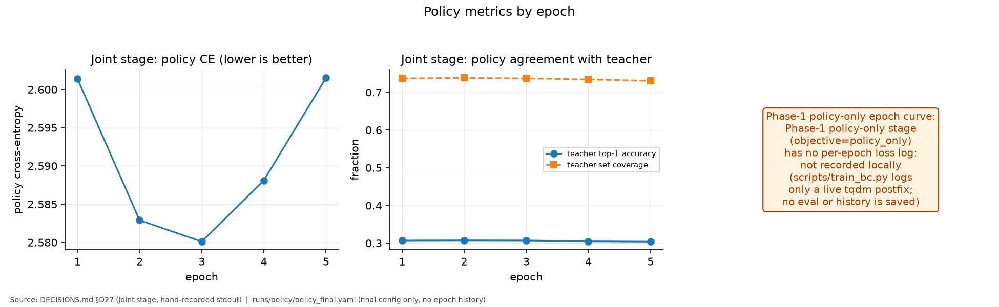

### D28. Lock a common oracle before another training run

**Status:** Adopted

**Setup and evidence:** Unseen real-game months supplied separate validation and test
splits, each with 200 positions in four absolute-score bins: `<0.5`, `0.5-2`, `2-5`,
and `>5` pawns. Stockfish depth 20 evaluated every model on the same transform,
`clip(cp / 1000, -1, 1)`. Policy metrics included exact best, within 50 cp, mean/p90/p95
regret, and paired bootstrap intervals. Test remained locked until validation passed.

**Decision:** Diagnose before training. No more comparing models on incompatible label
sets or promoting from ten-game noise.

### D29. Reject joint search and audit the label ceiling

**Status:** Diagnostic gate failed

**Setup and evidence:** The common oracle contained 800 validation and 800 untouched test
positions. Phase-2 natural MAE was 0.16527 vs 0.16544 for joint. Decisive sign was 66.5%
vs 66.0%; won sign was 74.5% vs 71.5%. Phase-2 at 64 sims and value scale 0.5 improved
mean regret by 22.05 cp with 95% CI `[4.15, 40.16]`, but p90 improved 9.21%, just below
the preregistered 10% floor. No joint configuration passed.

**What went wrong:** The policy improved slightly, but decisive value sign regressed.
The remaining ambiguity was whether depth-14 labels themselves disagreed with the
depth-20 oracle.

**Decision:** Keep the test split untouched. Audit depth-14 vs depth-20 before training
value harder.

### D30. Confirm label headroom and run one balanced value-head repair

**Status:** Teacher accepted, repair only partly promising

**Setup and evidence:** On 3,000 cached positions, depth-14 vs depth-20 bounded MAE was
0.0217, sign disagreement 2.90%, and decisive/won sign disagreement 0%. The model's
validation MAE was about 0.165, so teacher depth was not the bottleneck. The repair used
inverse-frequency bin sampling with weights from 1.000x to 1.894x, value-head only,
three epochs, and `lr=1e-4`. Epoch 1 was best.

**Decision:** Use the existing cache. Do not spend on a new depth-20 labeling campaign.
Validate epoch 1 directly against Phase-2.

### D31. Require a paired comparison for the value repair

**Status:** Promising point estimate, not promoted

**Setup and evidence:** Natural MAE improved from 0.16527 to 0.16341. Decisive sign rose
from 66.5% to 68.5%. At 64 sims and value scale 1, mean regret improved 28.22 cp vs raw
with 95% CI `[7.88, 49.63]`, and p90 fell 12.92%. Relative to Phase-2, point estimates
favored repair by 8.52 cp mean regret and 0.5 top-1 points.

**Decision:** Do not consume test from point estimates. Bootstrap repair directly against
Phase-2 on the same positions.

### D32. Treat the head-only repair as directional, not a champion

**Status:** Neutral

**Setup and evidence:** The direct repair-minus-Phase-2 mean-regret delta was 8.52 cp
with 95% CI `[-2.38, 20.68]`. Near-best improved 0.5 points with CI `[-0.5, 1.5]`.
P90 improved only 3.05% relative. The interval did not separate the models.

**Decision:** Keep Phase-2 as champion. Permit one norm-only capacity test with policy
KL anchoring; keep the locked test untouched.

### D33. Make the analysis figures reproducible

**Status:** Tooling adopted

**Setup and evidence:** `scripts/plot_run_analysis.py` and `kibitzer/run_analysis.py`
generated five figures for epoch value metrics, policy metrics, common-oracle bins,
search regret, and noisy WDL. Missing history stayed visibly missing instead of being
invented. Inputs had to declare `split=validation`.

**Decision:** A figure is part of the evidence only when its source is local, named,
and reproducible.

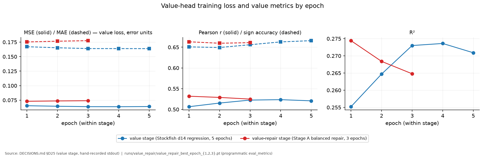

### D34. Reject norm-only repair and bound the last-block test

**Status:** Rejected

**Setup and evidence:** By epoch 5, train MSE fell to 0.0852 while held-out MSE rose to
0.0752, Pearson fell to 0.5216, and R2 to 0.2532. Decisive sign fell 0.98 points and won
sign 0.76 points. Policy KL was only 0.000009 with 99.84% top-1 agreement.

**What went wrong:** This was value overfitting, not policy drift. The shared norm gained
capacity, but the cache did not teach a value that generalized to searched positions.

**Decision:** Allow only one bounded last-block experiment. If epoch 0 stays best, close
the entire value-repair lineage.

### D35. Reject offline value gains as a strength proxy

**Status:** Value-repair lineage closed

**Setup and evidence:** Joint-from-scratch result-value training improved decisive sign
from 65.95% to 72.62% and won sign from 81.32% to 86.73%, but overall sign fell to
63.50% and Pearson to 0.4796. In play vs SF-1320, both cp-value and joint-scratch scored
0.100 at 64 sims. At 256 sims they scored 0.225 and 0.175. The cp-value model scored
0.200 at 512.

**What went wrong:** The run optimized a bin-level proxy that did not measure the value
needed under the search distribution. The apparent offline win did not survive the board.

**Decision:** Stop point value experiments. Search above 256 was flat on this base. Move
to a controlled scaling study.

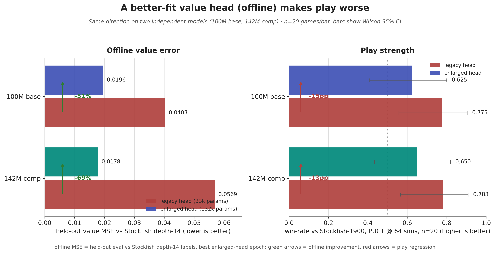

---

## Phase III. Scaling and honest strength calibration

> pivot: enough one-off runs. should we scale the archi, seriously? so i ran an actual
> scaling law instead of guessing, and adopted shaw chess-relative attention. measure the
> slope first, then spend the compute only where the slope is real.

### D36. Replace point experiments with a scaling-law study

**Status:** Adopted

**Question:** Was the ceiling caused by model size, data, or the architecture family?

**Setup:** An attention-first ladder varied parameter count at fixed data and data at
fixed S2. Held-out policy CE was primary because it was smooth; top-1 was the interpretable
capability metric; value MSE was secondary. LR transferred by width with warmup and cosine
decay.

**Decision:** Change one scaling variable at a time. Stop inferring a fundamental ceiling
from one undertrained 32M-class model.

### D37. Find a shallow parameter slope and a flat value slope

**Status:** Capacity not saturated, data starvation diagnosed

| model | parameters | policy CE | top-1 | value MSE |
|---|---:|---:|---:|---:|
| S0 | 2.98M | 2.3570 | 30.20% | 0.7118 |
| S1 | 7.43M | 2.3339 | 30.78% | 0.7213 |
| S2 | 14.89M | 2.3288 | 30.92% | 0.7177 |
| S3 | 22.89M | 2.3097 | 31.61% | 0.7211 |

**Read:** A 7.7x parameter increase bought only 0.047 CE and 1.41 top-1 points. The
curve still fell, so capacity had not saturated, but every rung was underfed. Value MSE
was flat across the full ladder.

**Decision:** Hold S2 fixed and scale data next.

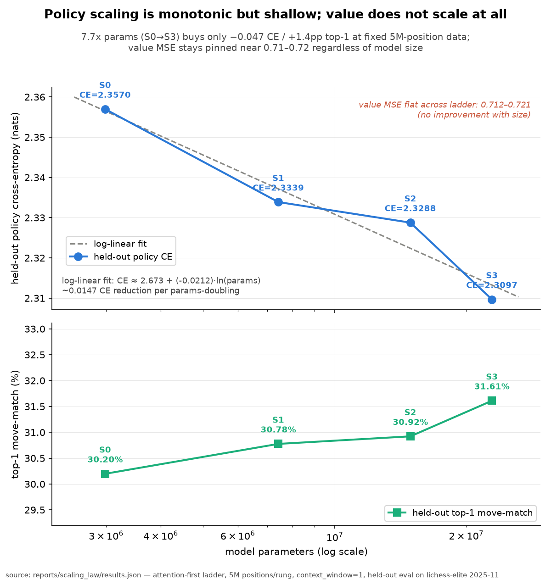

### D38. Confirm that data is about ten times the lever

**Status:** Successful

**Setup and evidence:** At fixed S2 and `lr=1.5e-4`, moving from 5M to 20M positions
reduced policy CE from 2.3288 to 2.0437, raised top-1 from 30.92% to 37.65%, and reduced
value MSE from 0.7177 to 0.6999. That was 0.1425 CE per data doubling vs 0.0147 per
parameter doubling.

**Why it worked:** The model had not seen enough unique chess. One data rung moved top-1
more than the entire parameter ladder.

**Decision:** Data is the primary training lever. Extend the curve rather than tuning
another value loss.

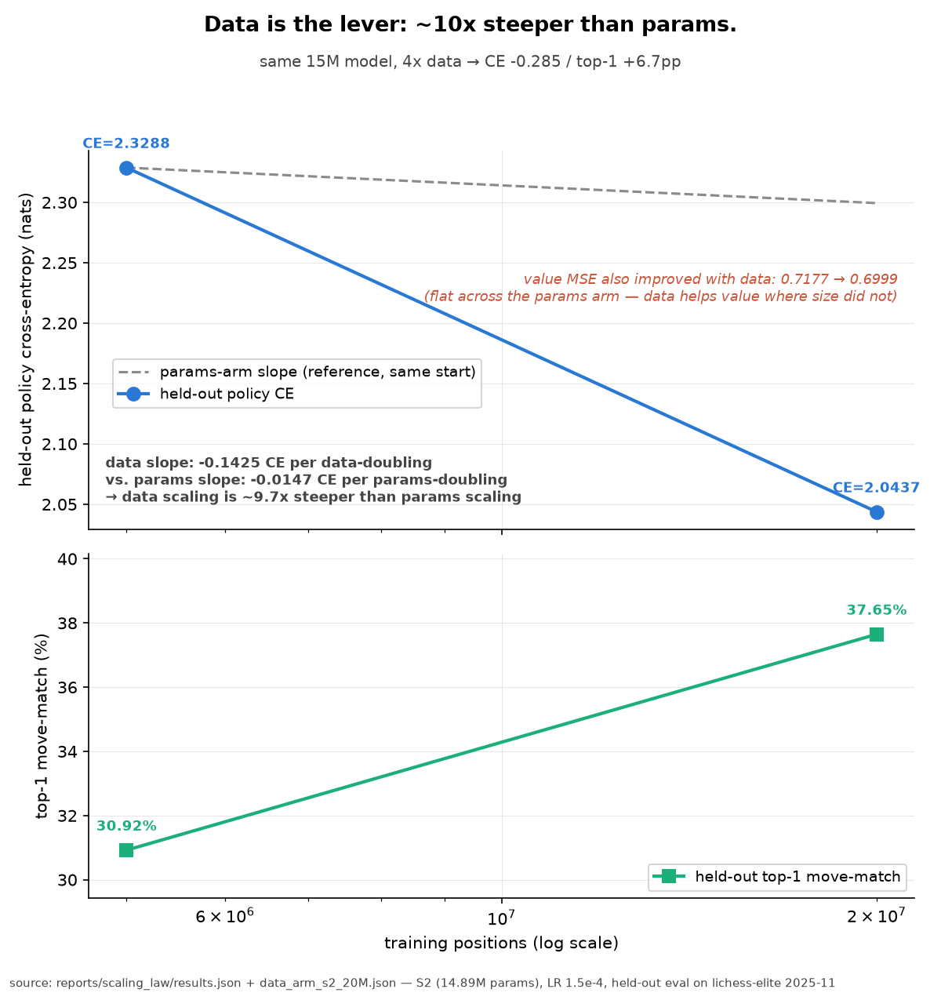

### D39. Adopt Shaw chess-relative attention

**Status:** Successful and adopted

**Question:** Can chess geometry improve sample efficiency without leaving the laptop
envelope?

**Setup and evidence:** A matched S2, 20M-position A/B replaced absolute square-only
attention with Shaw relative terms over 225 `(file_delta, rank_delta)` buckets.

| metric | absolute | Shaw | delta |
|---|---:|---:|---:|
| parameters | 14.89M | 15.22M | +2% |
| policy CE | 2.0437 | 2.0382 | -0.0055 |
| top-1 | 37.65% | 38.56% | +0.91 points |
| value MSE | 0.6999 | 0.6987 | -0.0012 |

The top-1 gain was about four standard errors on 50k held-out positions. Shaw S2 then
reached 44.52% top-1 at 40M positions.

**Why it worked:** Relative file/rank offsets encode reusable board geometry instead of
forcing the model to relearn the same relation for every absolute square pair.

**Decision:** Make Shaw the default for new checkpoints. Saved config preserves old
absolute checkpoints.

### D40. Reject TDLeaf after a controlled gate

**Status:** Rejected

**Question:** Can online search-coupled TD targets succeed where offline value repair
failed?

**Setup and evidence:** TDLeaf trained only the value head and final RMSNorm of the 40M
Shaw S2 base for roughly 200 games with `lambda=0.7`, 64 sims, and `lr=1e-4`.

| model | SF-1320 at 256 sims | SF-1900 at 256 sims |
|---|---:|---:|
| untrained Shaw base | 0.975 | 0.738 |
| TDLeaf | 0.975 | 0.762 |

The SF-1900 delta was +0.025 with standard error about 0.085.

**What went wrong:** TDLeaf changed some losses into draws but added no measurable score.
The real jump came from the scaled Shaw base and deep search already present in both arms.

**Decision:** Retire value-head training. Continue supervised scaling.

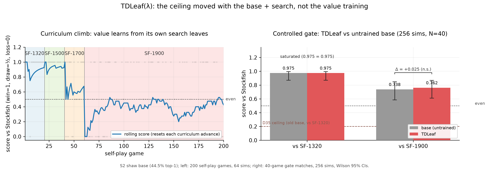

### D41. Stage the next supervised data run

**Status:** Staged, superseded by D42

**Setup:** The initial plan extended S2 Shaw from 40M to 80M positions with checkpointing,
the same held-out month, fixed LR `1.5e-4`, and 256-sim re-gating. S3 was conditional on
the S2 curve continuing.

**Decision:** Keep self-play and TDLeaf retired. The run target was later increased to
100M with in-loop play gates.

> pivot: the slope was real, so i committed. pull in more data and run the 100m shaw model
> on the laptop, scale it hard enough to bury the sft ceiling and actually reach ~2500. this
> is the one change that moved offline metrics and external play together, the honest jump.

### D42. Run S2 Shaw to 100M with in-loop play checks

**Status:** Completed

**Setup and evidence:** Training stayed fp32 on the local 4060 for numerical comparability.
Every 20M positions, the current model played 20 games vs SF-1900 at 64 sims. Patience
two and minimum delta 0.02 were available for early stopping, but the curve never gave a
reason to stop.

**Decision:** Use the cheaper 64-sim match only to track slope. Reserve 256 sims and the
larger ladder for final calibration.

### D43. Establish the 100M Shaw checkpoint as the first real scaling win

**Status:** Successful

**Setup and evidence:** The run took 15.3 hours. Held-out top-1 reached 49.45%, policy CE
1.57255, and value MSE about 0.650. The in-loop SF-1900 score rose monotonically:

| positions | SF-1900 score at 64 sims |
|---:|---:|
| 20M | 0.250 |
| 40M | 0.350 |
| 60M | 0.650 |
| 80M | 0.775 |
| 100M | 0.825 |

At 256 sims, the initial 20-game anchor estimated 2282 vs SF-1900, while a noisy
three-level fit suggested about 2470. The non-monotonic small ladder made the latter an
upper read, not a final claim. The checkpoint was published as
`Pradheep1647/kibitzer-s2-shaw-100m`.

**Why it worked:** This was the first experiment where offline policy quality and play
strength climbed together at every meaningful scale point.

**Decision:** Promote the 100M Shaw checkpoint and run a larger calibrated ladder.

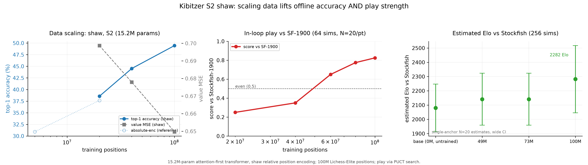

### D44. Calibrate the 100M Shaw model over 160 games

**Status:** Successful calibration

**Setup and evidence:** `S2_shaw_100M.pt` played 40 games per level at 256 sims with a
20-line opening book and alternating colors.

| opponent | score | W/D/L |
|---|---:|---:|
| SF-1900 | 0.938 | 37/1/2 |
| SF-2100 | 0.850 | 31/6/3 |
| SF-2300 | 0.700 | 24/8/8 |
| SF-2500 | 0.525 | 13/16/11 |

The combined score was 0.753. Sequential logistic fitting on the Stockfish
`UCI_LimitStrength` scale gave 2483 with approximate uncertainty of 32 Elo.

**Important caveat:** A prior cloud run with random eight-ply openings produced about
1697. That result was not comparable because it pushed the model into untrained opening
states. The fixed opening suite was part of the measurement, not a cosmetic detail.

**Decision:** Use 2483 as a relative Stockfish-ladder calibration for this checkpoint,
not as human FIDE Elo.

### D45. Treat tactical mid-training as neutral

**Status:** Neutral

**Setup and evidence:** The 100M model continued on 20M positions with 30% Lichess
puzzles and 70% elite games at `lr=5e-5`. Value loss was disabled after a 25k smoke test
showed puzzle value `+1` targets spiking value MSE from 0.65 to 0.96.

| opponent | tactical score | base score |
|---|---:|---:|
| SF-1900 | 0.887 | 0.938 |
| SF-2100 | 0.875 | 0.850 |
| SF-2300 | 0.600 | 0.700 |
| SF-2500 | 0.637 | 0.525 |

Tactical Elo was 2464 vs base 2483, a delta of -19 with heavily overlapping
uncertainty.

**What happened:** The run redistributed strength across opponents but did not move the
aggregate. Puzzle CE was trainable, but it was not the missing play signal.

**Decision:** Do not promote or publish the tactical continuation from this phase.

### D46. Separate Stockfish calibration from human-calibrated strength

**Status:** Calibration caveat added

**Setup and evidence:** The 100M model played Maia 1300, 1500, 1700, and 1900 at 256
sims, 40 games each. It scored 159W/1D/0L, or 0.997 overall.

**Read:** Maia established an honest human-calibrated lower bound above 1900, but its
available weights capped too low to locate the model. It could not validate the 2483
number directly.

**Decision:** Use Maia only as a lower bound and move to a stronger fixed Leela network
for the ceiling test.

### D47. Bracket the 100M model near 2500-2600

**Status:** Strength bracket accepted

**Setup and evidence:** The 100M model at 256 sims played the same Leela
`t1-256x10-distilled` network at increasing node counts.

| opponent | approximate label | score | W/D/L |
|---|---:|---:|---:|
| Leela at 1 node | 2700 | 0.354 | 3/11/10 |
| Leela at 8 nodes | 2850 | 0.104 | 2/1/21 |
| Leela at 32 nodes | 2950 | 0.042 | 0/2/22 |

The one-node score implied about 2596 on that proxy scale. Combined with D44 and D46,
the responsible claim was roughly 2500-2600, with a hard ceiling below the stronger
Leela settings.

**Decision:** Call the model a strong 2500-class engine, not a 3000 engine.

---

## Phase IV. Post-training repair mostly optimized the wrong thing

> pivot: now the trap. it plays around 2500, so surely a little self-play or clever
> fine-tuning pushes it further, some self-play already? branch after branch said no. fuck it,
> every experiment i ran here failed. beating my own base was never the same as beating anyone
> external, and that is the lesson that cost me the most runs.

### D48. Reject one-iteration hard-target AZ-lite

**Status:** Rejected

**Setup and evidence:** About 150 self-play games at 64 sims produced 14,089 positions.
The child behavior-cloned the search argmax and trained value on outcome for three epochs.
Loss fell from 0.98 to 0.76 without collapse. Against its parent at 64 sims, the child
scored 10W/11D/19L, or 0.388.

**What went wrong:** The self-play teacher was not clearly stronger than the 2500+ human
data that created the base. A cleanly optimized child still became weaker than its parent.

**Decision:** One cheap AZ-lite iteration is not a route upward.

### D49. Reject one-iteration soft-visit AlphaZero

**Status:** Rejected

**Setup and evidence:** Proper root Dirichlet noise and full visit-distribution targets
were added. About 120 games at 128 sims produced 10,730 positions. Policy loss fell from
1.83 to 1.72 and value loss from 0.29 to 0.14. The child scored 1W/13D/26L against the
base, or 0.188.

**What went wrong:** At 128 sims, the visit distribution was diffuse. Regressing a sharp
supervised policy toward that fuzzy target made the child passive and less decisive.
The more AlphaZero-like objective was more harmful at this small budget.

**Decision:** Close cheap single-iteration AZ. A full campaign would require much higher
sims, many iterations, and a growing replay buffer.

### D50. Reject PUCT knob tuning and classical alpha-beta

**Status:** Search tuning neutral, alpha-beta rejected

**Setup and evidence:** Search variants were compared at equal network-evaluation budgets.
An identical PUCT self-match scored 0.600 over 20 games, exposing the noise floor.

| variant | budget | score | W/D/L |
|---|---:|---:|---:|
| PUCT self-control | 128 | 0.600 | 7/10/3 |
| PUCT with FPU | 128 | 0.625 | 9/7/4 |
| PUCT with pruning | 128 | 0.600 | 6/12/2 |
| stacked PUCT | 128 | 0.563 | 9/9/6 |
| alpha-beta | 128 | 0.075 | 0/3/17 |
| alpha-beta plus quiescence | 128 | 0.025 | 0/1/19 |

**What went wrong:** PUCT variants stayed inside noise. Alpha-beta trusted the value head
directly as a minimax leaf evaluator and collapsed. PUCT survived because it averaged
many policy-guided evaluations.

**Decision:** Keep normal PUCT. The search algorithm was not the cheap missing lever;
the value representation feeding it was.

### D51. Treat competition-data continuation as neutral

**Status:** Neutral

**Setup and evidence:** TWIC issues 920-1652 yielded 570,268 games with both players
2400+, about 41.6M usable positions. Continuing the 100M base produced
`S2_shaw_142M_comp.pt` in 6.3 hours.

| comparison | result |
|---|---:|
| competition model vs online base, 30 games at 128 sims | 11W/14D/5L, 0.600 |
| online base vs SF-1900 at 64 sims | 0.775 |
| competition model vs SF-1900 at 64 sims | 0.783 |

The in-loop score dipped to 0.700 at 20M and recovered to 0.775 at 40M.

**What happened:** The model adapted to the distribution shift and recovered, but did
not establish a significant external gain. Scarcity also capped pure competition data
near 42M fresh positions.

**Decision:** Keep the checkpoint as a valid base, but do not call competition data a
new scaling slope.

### D52. Reject the enlarged value head despite a large offline win

**Status:** Rejected

**Setup and evidence:** The value head grew from 33,025 to 131,841 parameters and was
trained alone on the 250k depth-14 cache. Held-out MSE roughly halved: 0.0403 to 0.0196
on the online base and 0.0569 to 0.0178 on the competition model.

In play, SF-1900 score at 64 sims fell from 0.775 to 0.625 on the base and from 0.783
to 0.650 on the competition model. Against one-node Leela, the competition model fell
from 0.225 to 0.150. Alpha-beta still collapsed.

**What went wrong:** The larger head fit a narrow offline Stockfish cache very well, but
its calibration was worse on the positions and backups reached during real search.
Offline value accuracy and search utility were different objectives.

**Decision:** Close value-head size as a strength lever.

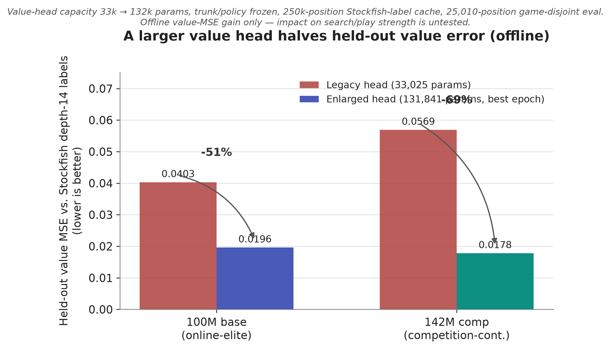

### D53. Reject the first reverse-KL Leela distillation run

**Status:** Rejected, configuration invalidated

**Setup and evidence:** Leela at 400 nodes labeled 17,044 student-generated positions.
Reverse KL fell from 0.71 to 0.24, but the child scored 0W/1D/8L against the competition
base.

**What went wrong:** Generation temperature 1.0 produced junk positions. All parameters
trained at `lr=2e-4` for four epochs, and there was no base-policy anchor. The run combined
bad states, a sharp zero-forcing target, and catastrophic forgetting.

**Decision:** Reject this run, not yet the whole objective. Permit one low-temperature,
head-only, anchored retry.

### D54. Close on-policy Leela policy distillation

**Status:** Rejected across configurations

**Setup and evidence:** The corrected retry used temperature 0.3, policy-head-only
training, `lr=5e-5`, reverse KL to Leela, and KL to the base. External one-node Leela
scores were:

| checkpoint | score |
|---|---:|
| competition base | 0.225 |
| aggressive v1 | 0.056 |
| gentle v2 | 0.100 |
| iterative round 1 | 0.200 |
| iterative round 2 | 0.125 |
| iterative round 3 | 0.150 |

The gentle child beat its own base head-to-head at 0.625 while scoring only 0.100
externally.

**What went wrong:** Reverse KL sharpened the policy toward Leela's searched distribution
and removed diversity that Kibitzer's own PUCT needed. The sibling win was style
exploitation, not strength.

**Decision:** Close engine-policy distillation. External opponents remain mandatory.

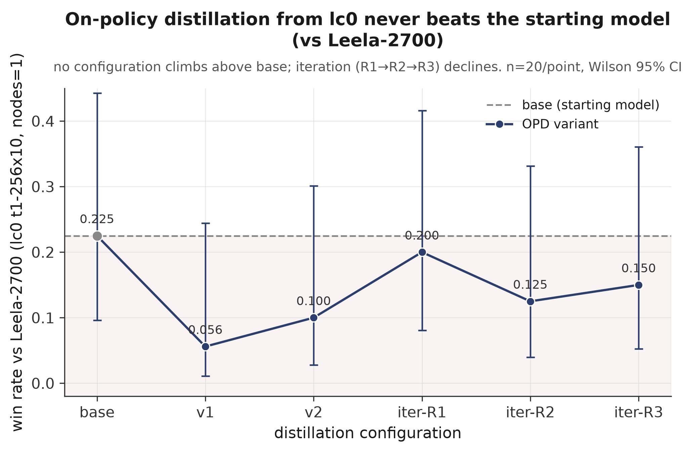

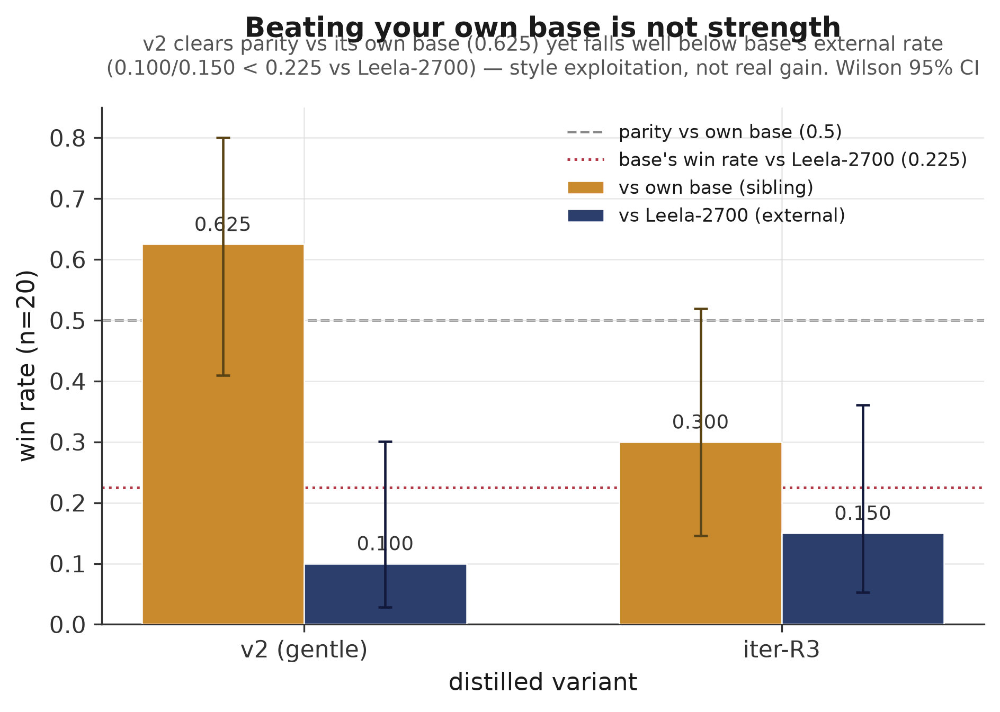

### D55. Kill slow, silent AZ generation

**Status:** Run stopped, observability rule adopted

**Setup and evidence:** Iteration 1 completed 80 games at 400 sims, 7,431 positions,
three train epochs, 0.625 vs base, and 0.100 vs one-node Leela. Iteration 2 spent about
2h44m generating 80 games and was killed before training. GPU utilization averaged 42%,
one CPU core was saturated, VRAM use was only 252 MB, and generation printed no progress.

**What went wrong:** Single-board MCTS forwards left the GPU mostly idle, while the
self-play buffer remained small and narrow. The child again beat a sibling while
regressing externally.

**Decision:** Require per-game progress, ETA, and artifact paths. Prefer lower sims with
more games until batched or parallel search exists.

### D56. Replace outcome-heavy regret repair with policy-only regret

**Status:** First run rejected, policy-only branch promising but unproven

**Setup and evidence:** The first buffer had 4,611 records, but only 764 were policy
regret hits. Another 3,995 survived because self-play outcome disagreed with Stockfish
value. That checkpoint scored 0.125 externally vs an older base reference of 0.225.

The policy-only run scored 0.175 over 20 games at 128 sims. A direct same-seed competition
base rerun scored 0.075, while an older base result had been 0.225. A broader run with
lower regret threshold and eight epochs scored 0.150.

**What went wrong:** The first repair quietly became another value experiment. The
policy-only filter was better, but the small conflicting base samples made its apparent
gain too uncertain to scale aggressively.

**Decision:** Keep `policy_regret_repair.pt` as a candidate for the next targeted test.
Do not broaden the noisy buffer further.

### D57. Reject self-play starting from regret positions

**Status:** Rejected

**Setup and evidence:** One thousand high-regret starts used 128 sims and 32 continuation
plies. Training used visit CE, a base KL anchor, heads plus final norm, and no value loss.
The child scored 1W/1D/18L, or 0.075, against the external proxy. The policy-regret parent
had scored 0.175.

**What went wrong:** Changing the start-state distribution did not change the target
source. The child still trained on its own search visits and overfit them.

**Decision:** Close regret-start self-play unless an external teacher labels continuation
states.

### D58. Promote tactical repair as the strongest trained checkpoint

**Status:** Successful, small but confirmed gain

**Setup and evidence:** A competition/puzzle supervised repair started from
`policy_regret_repair.pt`. Held-out top-1 moved from 0.4933 to 0.4922 and value MSE from
0.6562 to 0.6602, within the permissive offline gate. The first 20-game external probe
scored 0.250.

The paired 80-game gate at 128 sims and seed 17 gave:

| checkpoint | W/D/L | score | implied proxy Elo |
|---|---:|---:|---:|
| tactical repair R1 | 7/25/48 | 0.244 | 2503 |
| policy regret | 9/18/53 | 0.225 | 2485 |
| competition base | 6/17/57 | 0.181 | 2438 |

A seed-23 rerun put tactical R1 at 12W/23D/45L, score 0.294, proxy Elo 2548. A more
conservative tactical R2 passed offline but scored only 0.225, about 63 proxy Elo below
R1 on the same seed.

**Why R1 survived:** The supervised mix produced a small external gain that remained
visible over 80 games. The margin was not large, but it was the first post-100M update
that survived the actual promotion surface.

**Decision:** Promote `runs/tactical/tactical_repair.pt`. Reject R2 and stop extending
the same tactical recipe.

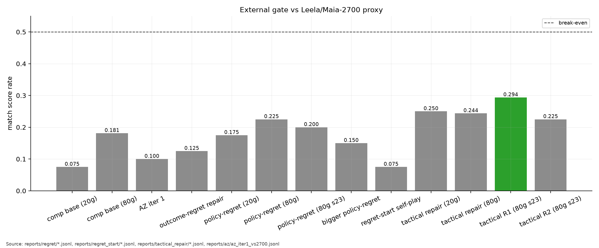

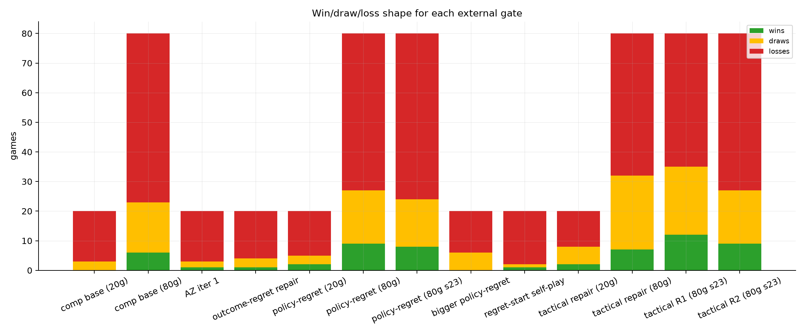

### D59. Reject teacher-preference repair

**Status:** Rejected twice

**Setup and evidence:** A DPO/AWAC-style buffer paired Stockfish's best move with the
current policy's highest-probability worse move. The first buffer had 52,250 pairs,
mean teacher margin 0.236, and 21,217 pairs where the bad move used a MultiPV floor.
Offline pair accuracy reached 0.607 with margin 0.772.

The first external gate was stopped at 62 games: 3W/13D/46L, score 0.153. A conservative
retry with `lr=3e-6`, one epoch, lower beta, and a stronger anchor reached 4W/17D/41L,
score 0.202. Tactical R1's reference was 0.294.

**What went wrong:** The floor-heavy pairs were too noisy and aggressive. Stronger
anchoring reduced damage but could not create useful signal from the same labels.

**Decision:** Close this preference buffer. A future preference method would need cleaner
teacher comparisons before any optimizer tuning.

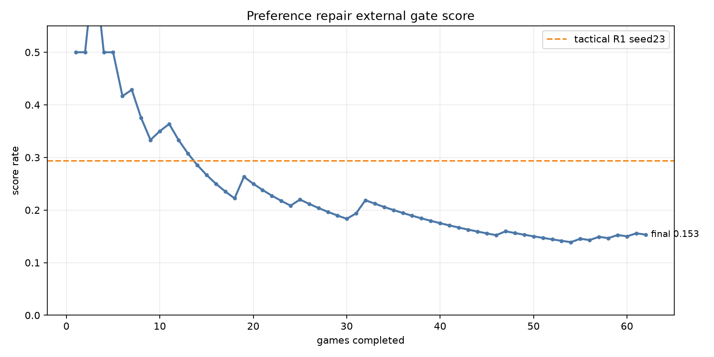

---

## Phase V. RL and the search ceiling

### D60. Test critic-free GRPO with an external outcome reward

**Status:** Neutral, stopped at iteration 11 of 30

**Question:** Did earlier RL fail because it used self-referential targets and a weak
learned critic?

**Design:** The rollout policy started from `tactical_repair.pt`. Games were grouped by
opening, color, and opponent Elo. PUCT selected moves, Stockfish supplied the external
opponent, and the terminal result was the only reward. The value head and trunk stayed
frozen. Only the policy head and final norm trained.

For game $i$ in group $g$, reward and critic-free group advantage were:

$$
R_i \in \{0, 0.5, 1\}, \qquad
\hat{A}_i = \frac{R_i - \bar{R}_g}{\sqrt{\frac{1}{|g|}
\sum_{j \in g}(R_j - \bar{R}_g)^2} + 10^{-4}}.
$$

The update used the played-action importance ratio

$$
r_t = \frac{\pi_\theta(a_t \mid s_t)}{\mu(a_t \mid s_t)},
$$

exact total variation over legal moves,

$$
D_{\mathrm{TV},t} = \frac{1}{2}\sum_{a \in L(s_t)}
\left|\pi_\theta(a \mid s_t) - \mu(a \mid s_t)\right|,
$$

and a directional DPPO mask that blocked updates moving farther past TV radius 0.2.
A forward KL with weight 0.05 anchored the policy to the frozen tactical base:

$$
\mathcal{L}(\theta) = -\frac{\sum_t m_t r_t \hat{A}_t}{\sum_t m_t}
+ 0.05\,\frac{1}{T}\sum_t
\mathrm{KL}\!\left(\pi_\theta(\cdot \mid s_t)\,\|\,
\pi_{\mathrm{base}}(\cdot \mid s_t)\right).
$$

The reserved MaxRL reward transform was written without unsupported rendering macros.
If $P_k$ denotes pass at $k$, the intended harmonic mixture was:

$$
\nabla_\theta J_{\mathrm{MaxRL}} =
\sum_{k=1}^{T}\frac{1}{k}\,\nabla_\theta P_k.
$$

**Evidence:** The adaptive ladder climbed from SF-1900 to SF-2500 while the model held
about 54%, but that was the static base finding its level. The held-out SF-2000 probe was
0.9125 at iteration 5 and 0.900 at iteration 10. The best checkpoint, `grpo_v5`, scored
12W/20D/48L, or 0.275, against the external proxy. Tactical R1 scored 12W/23D/45L,
or 0.294.

**What went wrong:** Search-based rollouts made the games strong and the trust region
prevented collapse. The reward still assigned one scalar result to every move. It was
good enough to preserve the base and too weak to identify which decisions deserved the
credit. The ladder climb was calibration, not learning.

**Decision:** Stop at iteration 11. GRPO held strength but added no external gain.

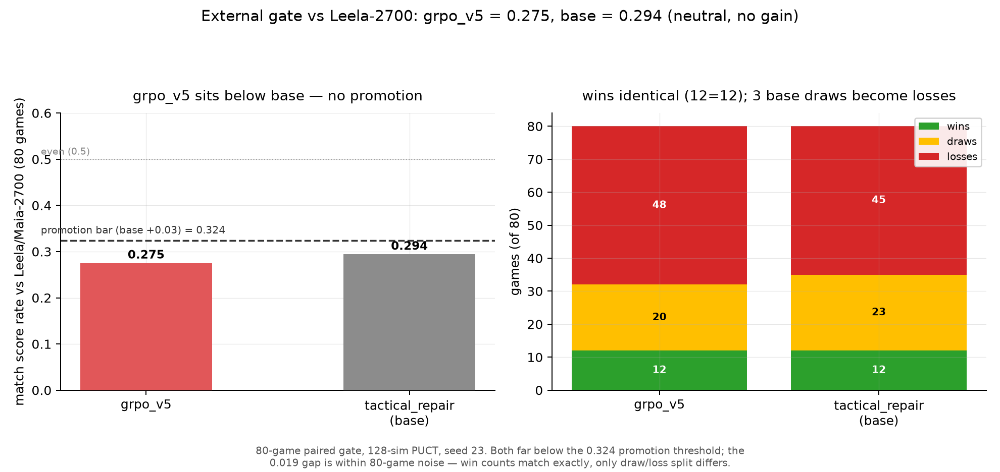

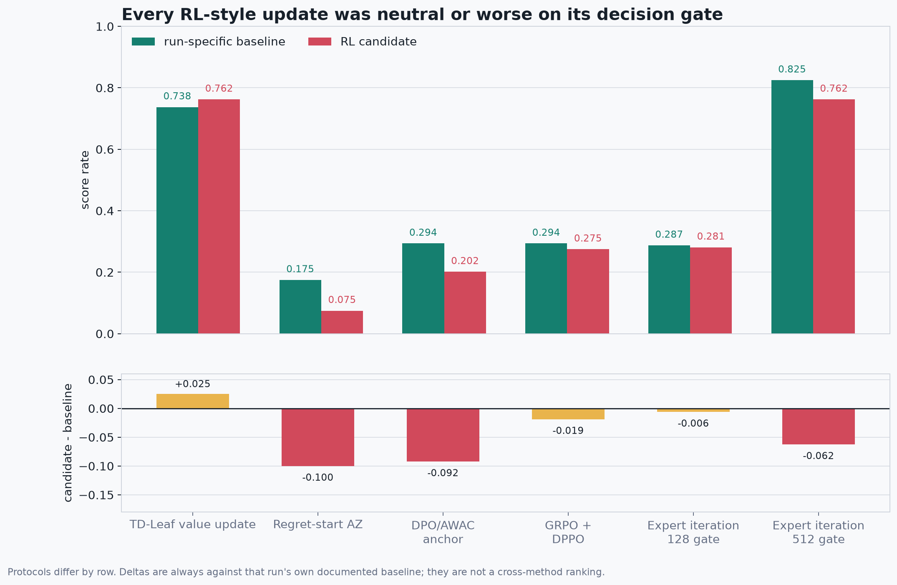

### D61. Reject Gumbel AlphaZero search at the cheap gate

**Status:** Rejected for this configuration

**Question:** Can Sequential Halving improve low-budget search where normal PUCT and
PUCT tuning did not?

**Setup and evidence:** The experiment changed search only. Normal PUCT and Gumbel used
the same tactical checkpoint, one-node Leela opponent, openings, colors, seed 23, and
128 network evaluations per move.

| search | W/D/L | score | implied proxy Elo |
|---|---:|---:|---:|
| normal PUCT | 6/11/23 | 0.2875 | 2542 |
| Gumbel | 3/14/23 | 0.2500 | 2509 |

The paired score delta was -0.0375 with bootstrap 95% interval `[-0.200, 0.125]`.

**What happened:** The interval did not prove Gumbel intrinsically worse, but the point
estimate crossed the pre-registered stop line and produced no positive evidence. Both
methods lost 23 games; Gumbel converted three wins into draws.

**Decision:** Do not run the 80-game confirmation or generate Gumbel self-play. Keep
normal PUCT.

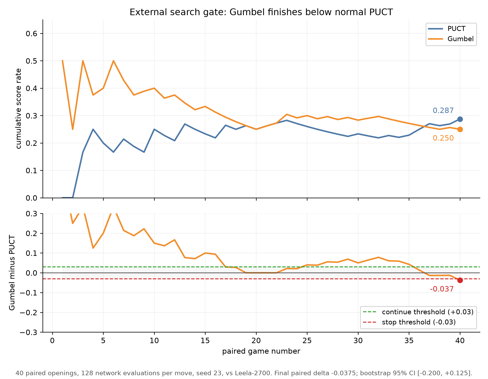

### D62. Reject value down-weighting

**Status:** Rejected

**Question:** Mechanistic inspection showed a noisy, late value signal. Would trusting it
less make search stronger?

**Setup and evidence:** Tactical R1 played the one-node Leela proxy at 128 sims, seed 23,
while only `value_scale` changed.

| value scale | W/D/L | score | implied proxy Elo |
|---:|---:|---:|---:|
| 1.00 | 6/11/23 | 0.287 | 2542 |
| 0.75 | 3/7/30 | 0.163 | 2415 |
| 0.50 | 2/1/37 | 0.062 | 2230 |

**What went wrong with the hypothesis:** The interpretation was half right. The value
head was noisy, but it was also load-bearing. Reducing its weight removed the signal that
turned the raw policy prior into strong searched play.

**Decision:** Keep `value_scale=1.0`. D52 and D62 fence the value head from both sides:
fitting it harder offline hurt, and trusting it less hurt much more.

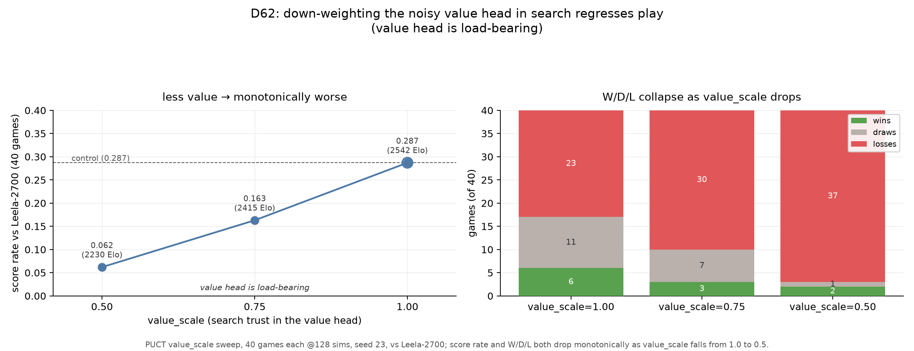

### D63. Establish simulation count as a major inference lever

**Status:** Successful search result, not a new trained model

**Question:** Was the 128-sim external gate already extracting all available strength?

**Setup and evidence:** The tactical checkpoint and one-node Leela opponent stayed fixed.
Only PUCT simulations changed, with 40 games per point and seed 23.

| sims | W/D/L | score | Elo delta | implied proxy Elo |
|---:|---:|---:|---:|---:|
| 64 | 3/1/36 | 0.087 | -407 | 2293 |
| 128 | 6/11/23 | 0.287 | -158 | 2542 |
| 256 | 5/16/19 | 0.325 | -127 | 2573 |
| 512 | 29/8/3 | 0.825 | +269 | 2969 |

**Read:** The 512-sim point was a phase change. Losses fell from 23 at 128 sims to 3.
This does not mean the weights are intrinsically 2969 Elo. Kibitzer spent 512 network
evaluations per move while the opponent used one node. It does prove that the checkpoint
was compute-starved at the cheap gate.

**Decision:** Keep 128 sims for cheap iteration. Use 512 sims for serious inference and
compare against stronger, better-matched opponents before making a public Elo claim.

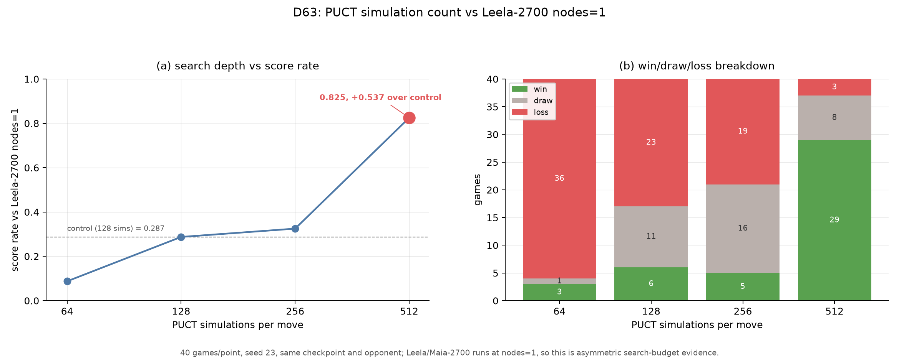

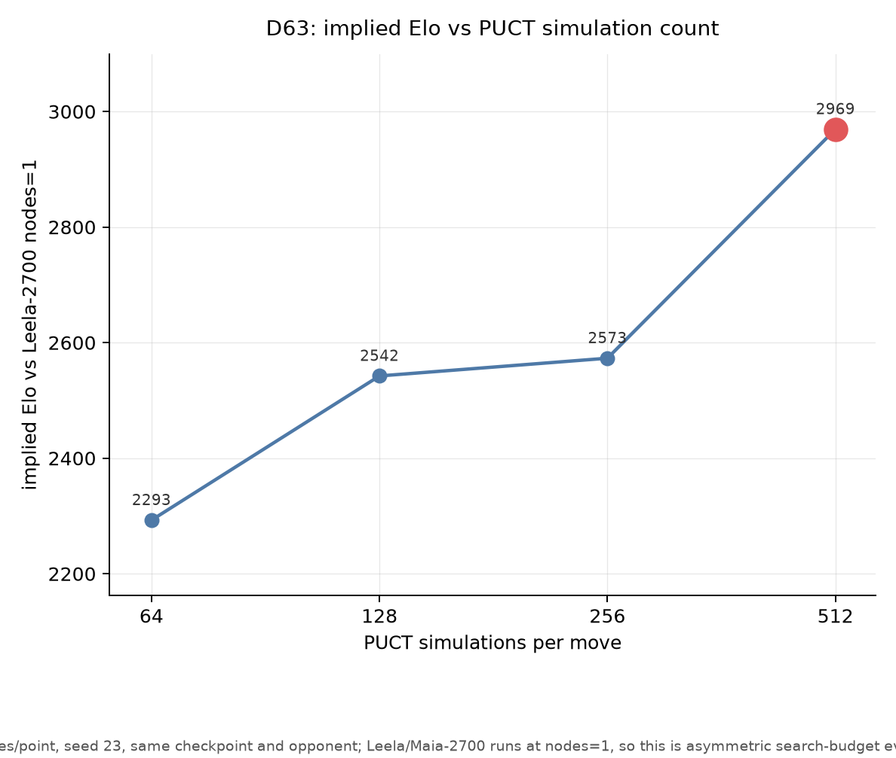

> pivot: search at 512 sims was clearly stronger, so the obvious move was, cant we do
> self-play if 512 sims is getting us better results? the answer was no. that strength lived
> inside the search and never distilled into the weights. the only lever left was scaling the
> params, and i chose not to pull it for this run. this is where i call the ceiling, honestly
> measured, not a bug i failed to find.

### D64. Use corpus failure analysis to reject a mate-only patch

**Status:** Mate repair and opening repair rejected

**Question:** Were the remaining losses caused by a narrow tactical or mating weakness?

**Setup and evidence:** Stockfish depth 12 rescored every model move across 336 valid
games. ACPL used only contested positions with absolute evaluation at most 600 cp. Void
and time-forfeit games were excluded.

| phase | ACPL per move | blunders at least 200 cp |
|---|---:|---:|
| opening | 8.4 | 1 |
| middlegame | 32.8 | 151 |
| endgame | 44.2 | 119 |

Of 106 decisive losses, 81, or 76%, were gradual. Only 25 were sudden single-throw
losses. Endgame ACPL vs the Leela proxy was 52.9.

**What went wrong with the mate hypothesis:** Mate blindness was a visible symptom in a
small sample, not the dominant disease. The model usually drifted into a lost position
through locally plausible moves. A mate patch would target part of the 24% sudden bucket
while ignoring the 76% gradual bucket. Opening repair was even less justified because
the opening was already the cleanest phase.

**Decision:** Retire mate-only and opening-only repair. The evidence points at positional
value drift and endgame representation.

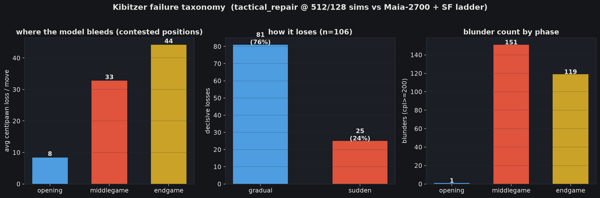

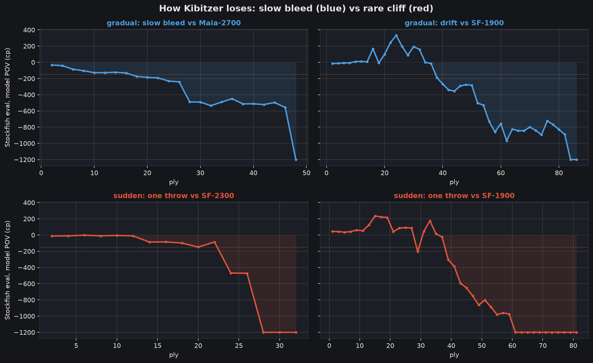

### D65. Reject 512-sim expert-iteration distillation

**Status:** Rejected

**Question:** Earlier self-play used a weak 128-sim teacher. Can the strong 512-sim search
from D63 distill its gain into the policy weights?

**Setup and evidence:** Two hundred self-play games at 512 sims produced 18,339 positions.
Training updated only the policy head and final norm using hard search-argmax targets and
KL-to-base 0.05. The value head remained frozen.

| external gate | child | base | promotion bar |
|---|---:|---:|---:|
| 128 sims, 80 games | 0.281, 14W/17D/49L | 0.287 | 0.317 |
| 512 sims, 40 games | 0.762, 28W/5D/7L | 0.825 | 0.855 |

**What went wrong:** The 512-sim gain came from repeated search averaging over a noisy
value signal. Hard policy targets captured the selected moves, not the computation that
made those moves reliable. Better priors alone did not reproduce the denoising process
and slightly reduced 512-sim strength.

**Decision:** The deep-search gain is inference-only for this experiment. Close the last
obvious self-play loophole.

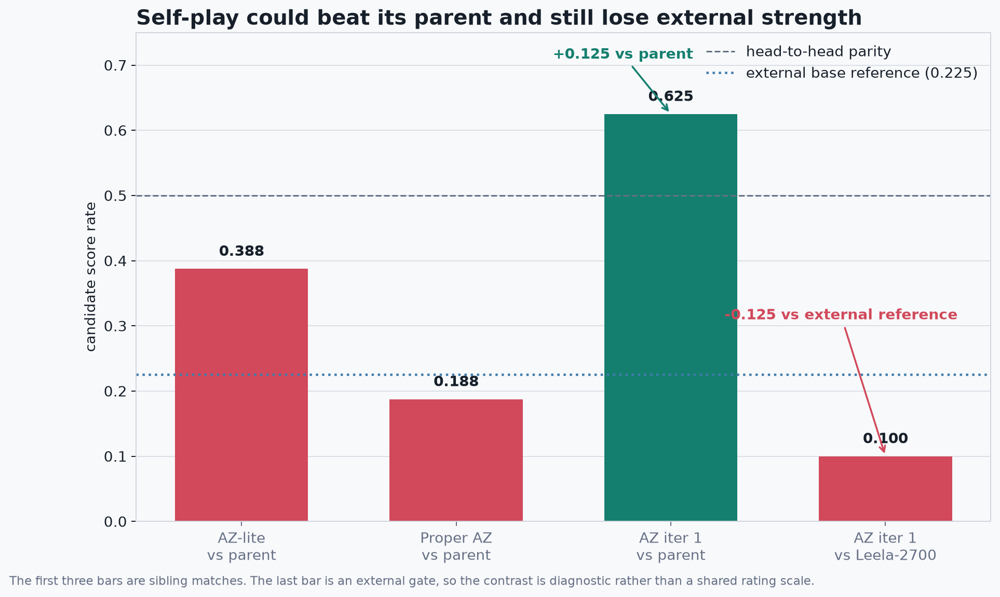

### D66. Reject oracle-shaped process-reward repair

**Status:** Rejected safely, base restored exactly

**Question:** Did GRPO fail specifically because terminal reward assigned the same credit
to every move?

**Setup:** Tactical R1 played 32 fresh games vs SF-2300 using 512-sim PUCT, opening
temperature 0.8 through ply 20, and a 160-ply cap. The rollout scored 22W/8D/2L and
produced 1,665 model positions. Stockfish at 10,000 nodes and MultiPV 4 labeled every
sampled action.

The mover-perspective process reward and backward return were:

```text
process_reward = clip((chosen_value - best_value) / 0.5, -1, 1)
return_t = 0.25 * process_reward_t + 0.99 * return_(t+1)
terminal return = z in {-1, 0, +1}
```

Filtering at regret at least 0.05 and absolute advantage at least 0.1 retained 220 of
1,665 positions: 87 positive and 133 negative. The policy head and final norm trained;
the encoder, trunk, and value head stayed frozen. Group splitting left 167 train and 53
held-out positions.

**Evidence:** The original top-1 selector was too discrete and stayed exactly flat. A
second run used held-out signed sampled-action log probability as a smooth selector.

| metric | epoch 0 | epoch 1 | epoch 2 |
|---|---:|---:|---:|
| top-1 regret | 0.079830 | 0.079830 | 0.079830 |
| expected teacher regret | 0.0845723 | 0.0845715 | 0.0845709 |
| held-out signed log probability | 0.5807979 | 0.5807869 | 0.5807538 |
| mean TV to base | 0.000000 | 0.000163 | 0.000311 |

Expected regret improved by only 0.0000014, while the held-out RL objective worsened.
The selector correctly chose epoch 0. The final model has maximum absolute tensor
difference 0.0 from tactical R1 and zero changed tensors. The completed seed-31 gate of
6W/21D/53L, score 0.206, is therefore another base sample, not an RL regression.

**What went wrong:** Dense labels solved reward sparsity operationally, but only 220
positions survived. PUCT selected actions while the stored behavior distribution was the
raw policy prior, so this was not exact behavior-policy correction. There was also a
teacher-budget mismatch: out-of-MultiPV chosen moves received a dedicated root analysis,
while the teacher best kept its MultiPV score. Positive process rewards up to +0.454
exposed that label noise because chosen-minus-best should not be positive.

**Decision:** Reject the update and keep the exact base. A real retry would require exact
visit-policy logging, equal root-move analysis budgets, and a much larger grouped buffer.
Coefficient tuning on these 220 positions is not justified.

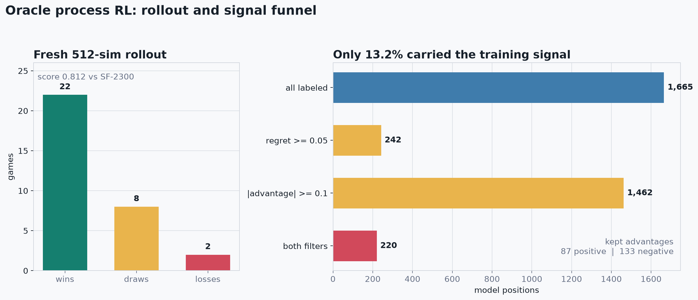

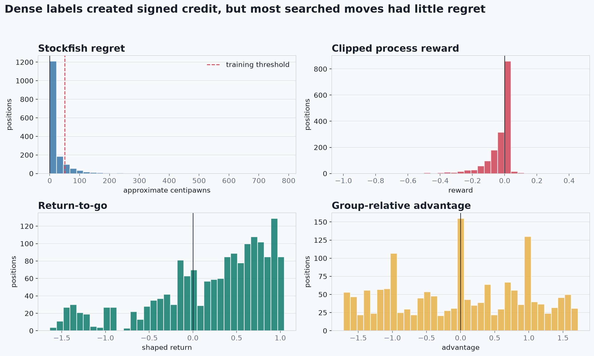

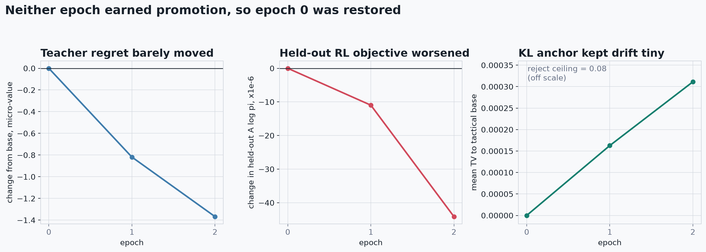

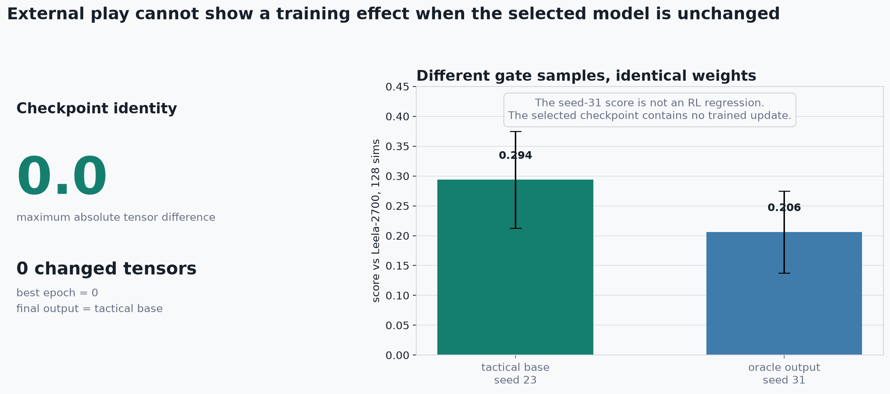

---

## What actually failed

The failed runs fall into a small number of mechanisms. This is the part I would carry
into the next project.

| failure mechanism | strongest evidence | practical lesson |
|---|---|---|
| history and state-distribution mismatch | D10, D11, D21 | A strong teacher cannot rescue states or histories the deployed model does not encounter. |
| target removed the useful argmax | D23, D49 | A converged loss is meaningless when temperature turns a decisive teacher into a diffuse target. |
| offline value proxy did not match search utility | D30-D35, D52 | Value MSE and sign can improve while PUCT becomes weaker. Gate the searched policy. |
| sibling overfitting | D48, D53, D54, D55 | Beating the parent is not external strength. Always keep a fixed opponent. |
| weak or misassigned RL credit | D60, D66 | Terminal reward is too broad, but dense process reward also needs enough clean, behavior-corrected data. |
| search computation did not distill | D63, D65 | The selected move does not contain the repeated value averaging that made it strong. |
| narrow repair attacked a symptom | D64 | Corpus-level failure analysis must precede mate, opening, or puzzle patches. |

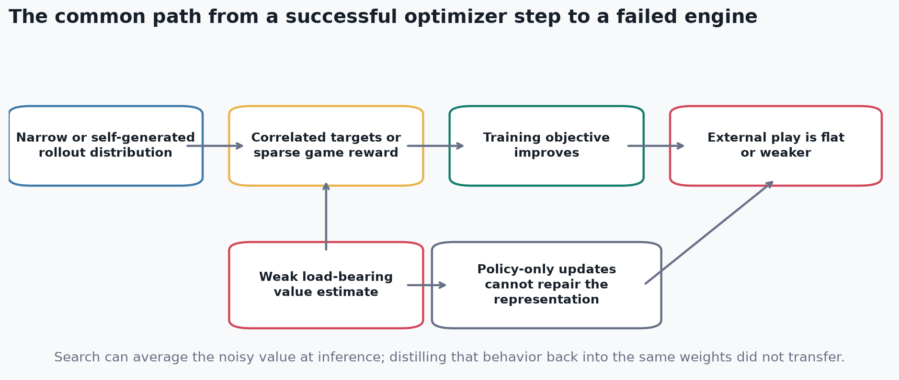

## Final research position

The project did not hit a mysterious optimization wall. It hit a representation and
compute boundary that the experiments progressively isolated.

1. The original model was fragile because it was history-dependent and trained on too
   little mismatched data.
2. The position-only rebuild made training stable, but its value head remained weak
   under search.
3. More unique supervised positions and Shaw relative attention were the only training
   changes with a monotonic offline and external-play slope.
4. Tactical R1 produced a small, real post-training lift and remains the strongest
   checkpoint.
5. Deeper PUCT produced the largest remaining gain, but D65 showed that the gain did not
   distill into policy weights.
6. Every tested RL variant either regressed, stayed inside noise, or restored the base.

So this is a ceiling for the current 15.2M architecture and training envelope, not a
universal ceiling for learning chess. The next credible move is materially different:
a larger or better pooled spatial representation trained on more data, followed by the
same locked external gates. Another coefficient sweep on the current repair buffers is
not a new experiment.

## My note, signing off

i want to be blunt about where this landed. the wall is not mysterious and it is not some
optimization bug i failed to find. the model is data and representation bound, and the one
lever with a positive slope still in front of me is scaling the params, which i chose not to
pull for this run. so the honest result is a ~2500 to 2600 engine trained on a laptop, a stack
of negative results that each rule something concrete out, and a clean plan for what i would
do with more compute.

that plan is the artifact, not the elo number. i am tired, and i am okay saying that, but i am
not confused about what happened here. that clarity is the thing i actually wanted out of this.
if i come back to kibitzer, i come back for scale, with these same locked external gates
waiting for it.
