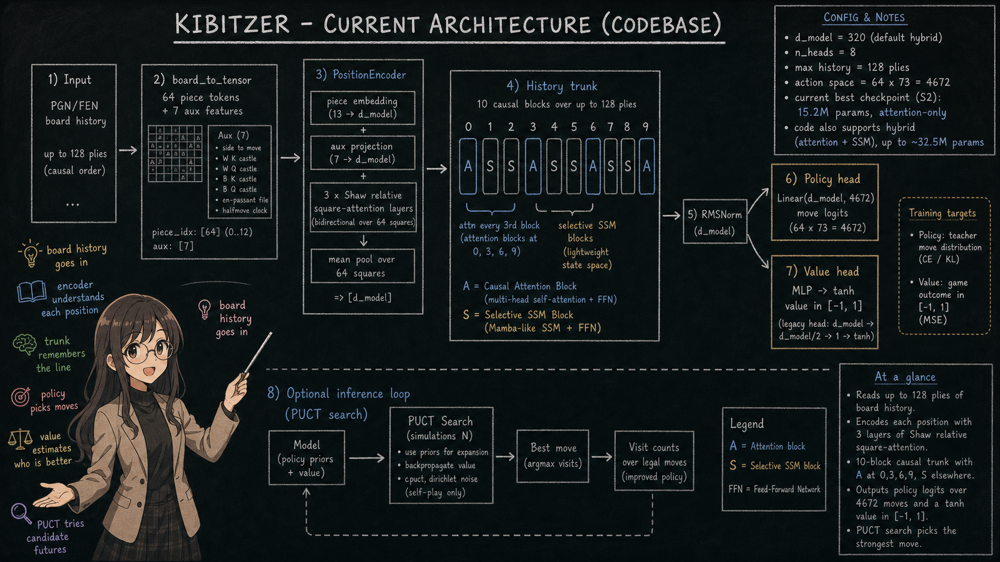
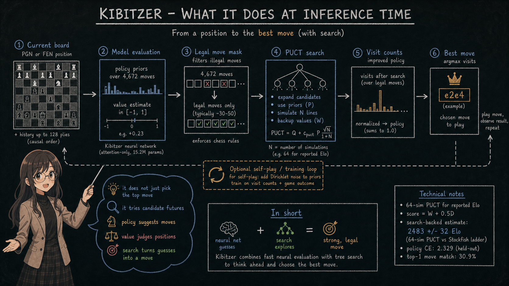
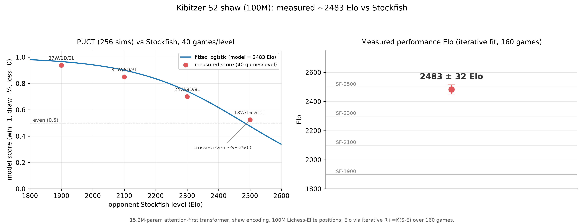
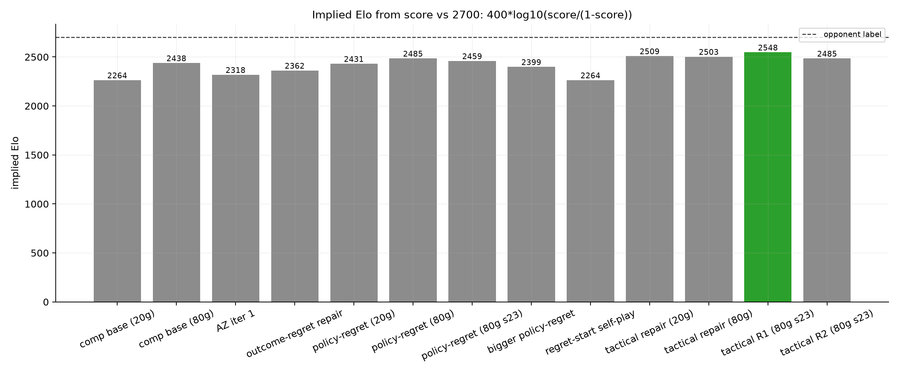
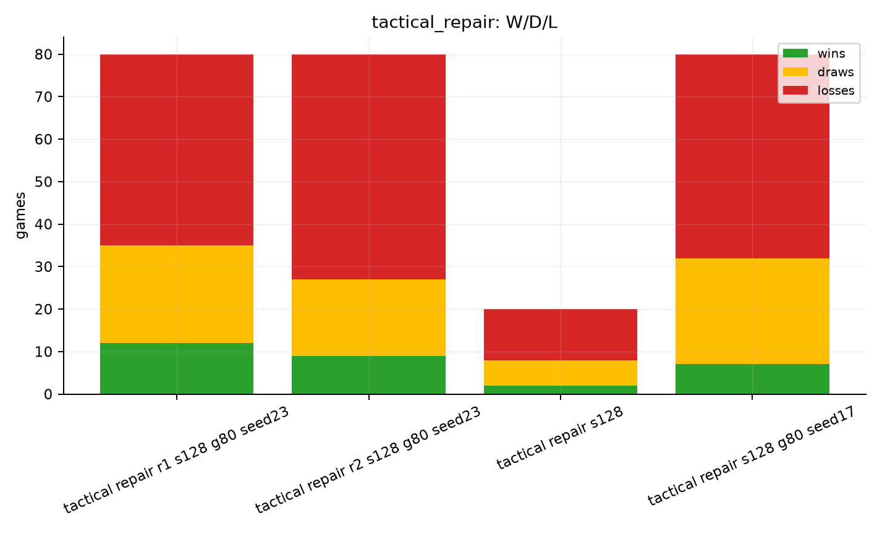
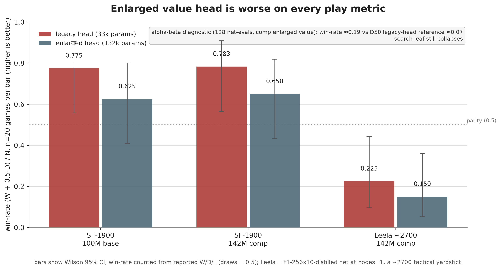

# kibitzer

chess is one of the games i'm fascinated by, so i constrained myself to a laptop rtx 4060 and asked how far i could push a small chess model. this repo is that experiment: a 15.2m-param attention-only policy/value model trained on lichess elite games, evaluated with search, and iterated through a bunch of failed and useful ideas.

(the codebase supports both attention-only and a transformer + selective-SSM hybrid, up to 32.5m params. the best trained checkpoint right now is 15.2m, attention-only, 142m positions -- that's what all the evals below use.)

## architecture



**current best checkpoint (all evals use this):**

| thing | value |
|---|---|
| d_model | 256 |
| trunk layers | 10 (all causal attention) |
| attention heads | 8 |
| position encoding | 3-layer cross-attention (shaw) |
| max sequence | 128 (plies of history) |
| params | **15.2m** |
| training data | 142m lichess elite positions |

**default config (code design, not yet trained at this size):**

| thing | value |
|---|---|
| d_model | 320 |
| trunk layers | 10 (4 attention, 6 selective SSM) |
| ssm state dim | 8 |
| params | **32.5m** |

the diagram is the current code path, with exact parameter counts written in the figure. the core idea: **attention is good at global reasoning, SSM is cheaper**. interleave them - every 3rd trunk block is attention, the rest are SSM. you get the benefits of both without paying full-attention cost across the whole sequence.

## published model

strongest published checkpoint: **[`Pradheep1647/kibitzer-tactical-repair`](https://huggingface.co/Pradheep1647/kibitzer-tactical-repair)**.

base supervised checkpoint: **[`Pradheep1647/kibitzer-s2-shaw-142m-comp`](https://huggingface.co/Pradheep1647/kibitzer-s2-shaw-142m-comp)**.

| artifact | value |
|---|---|
| checkpoint | `tactical_repair.pt` |
| local path | `runs/tactical/tactical_repair.pt` |
| hf repo | [`Pradheep1647/kibitzer-tactical-repair`](https://huggingface.co/Pradheep1647/kibitzer-tactical-repair) |
| training objective | `tactical_supervised_repair_r1_policy_only` |
| eval setup | 128-sim PUCT vs Leela/Maia proxy unless stated otherwise |

## what it does

given a board, run PUCT search (like alphazero) - the model provides priors for the search tree and evaluates leaf positions. the search returns the best move and visit counts.



## current state

### elo (search-based)

assessed against stockfish ladder, 64 sims PUCT:



protocol: Stockfish was run with `UCI_LimitStrength` at fixed Elo settings; Kibitzer used the S2 Shaw 142m checkpoint plus 64 PUCT simulations per move. Score is `(wins + 0.5 * draws) / games` from Kibitzer's side. The Elo estimate is a fit over the ladder, not a raw-policy rating.

| opponent (sf elo) | score | result |
|---|---|---|
| 1900 | 0.938 | 37W / 1D / 2L |
| 2100 | 0.850 | 31W / 6D / 3L |
| 2300 | 0.700 | 24W / 8D / 8L |
| 2500 | 0.525 | 13W / 16D / 11L |

estimated elo: **2483 ± 32** (search-based, 64 sims)

read this as: with search enabled, the model is roughly even with the 2500 Stockfish setting under this specific ladder, and clearly above the 1900-2300 settings. it is not a standalone no-search rating, and it is not a claim about tournament engine strength outside this protocol. PGNs and JSON summaries live under `reports/scaling_law/elo_local/`.

### scaling study

the attention-only backbone scales as a clean power law (S0 → S3, all on 5m positions):

| tag | params | policy ce | top-1 move match |
|---|---|---|---|
| S0 | 3.0m | 2.357 | 30.2% |
| S1 | 7.4m | 2.334 | 30.8% |
| S2 | 14.9m | 2.329 | 30.9% |
| S3 | 22.9m | 2.310 | 31.6% |


the raw policy ce keeps dropping with scale, but top-1 move match is flattening fast - we're hitting the human-move ceiling (~31-32%). the model correctly predicts the human move roughly a third of the time from 5m training positions. **more data helps more than more params.**

the production model (S2 shaw comp, 14.9m params) was trained on **142m positions** and is the one used in all gameplay evaluations below.

### current repair branch

the strongest local checkpoint right now is **`runs/tactical/tactical_repair.pt`**. it is not a new published base yet; it is a tactical supervised repair on top of `policy_regret_repair.pt`.

paired 80-game gates vs the Leela/Maia-2700 proxy at 128 sims:

| checkpoint | W/D/L | score | implied elo |
|---|---:|---:|---:|
| `tactical_repair.pt` seed 17 | 7W / 25D / 48L | 0.244 | 2503 |
| `tactical_repair.pt` seed 23 | 12W / 23D / 45L | 0.294 | 2548 |
| `tactical_repair_r2.pt` seed 23 | 9W / 18D / 53L | 0.225 | 2485 |
| `policy_regret_repair.pt` seed 23 | 8W / 16D / 56L | 0.200 | 2459 |

takeaway: tactical R1 is the current best local branch. tactical R2 passed the held-out top-1 gate but failed the external gate, so it should not be promoted.






folder-level plots:
- [repair eval rollup](reports/repair_eval/README.md)
- [tactical repair plots](reports/tactical_repair/README.md)
- [regret repair plots](reports/regret/README.md)
- [regret-start plots](reports/regret_start/README.md)
- [az eval plots](reports/az/README.md)

### az self-play

alphazero-style self-play: the model plays against itself using PUCT search with dirichlet root noise, trains on the visit distribution + game outcome, then we match the new model vs the old one.

| iter | vs base score | vs maia 2700 | notes |
|---|---|---|---|
| 1 | **0.625** | 0.100 | beats itself, regresses vs maia |
| 2 | killed | - | 400 sims too slow, see [decision.md](decision.md) |

the pattern: az improves the model against its own play style (0.625 h2h) but makes it *worse* against strong opponents (maia 2700: 0.100 vs base ref 0.225). classic self-play overfitting when the data is narrow - 80 games isn't enough diversity. the new config (200 games @ 200 sims) aims to fix this.

### on-policy distillation (lc0)

student plays its own games, lc0 labels each position. trains reverse-KL toward the teacher.


promising trajectory - the distilled model holds up decently against maia 2700. the teacher knowledge transfers well because the positions are from the student's own distribution.

### td-leaf value repair

self-play vs stockfish with online value-head training. curriculum ladder: 1320 → 1500 → 1700 → 1900.


crushed 1320-1700 easily, hit a wall at 1900 (rolling score ~0.35-0.45, never made it to 2100). the value head learns fast early on but plateaus when stockfish stops making tactical blunders. 200 games, 50 updates, ~15s/game.

### value head experiments

two separate experiments, same conclusion: the value head is not the bottleneck.

**joint-scratch (D30-D35):** trained policy + value together from a random init instead of the two-phase policy-then-value approach. the decisive-sign metric improved +6.67pp (65.95% → 72.62%). in actual play? tied-to-worse vs stockfish-1320 within the ±0.09 noise of a 20-game match.

**scaled value head (D52):** the value head is suspiciously thin: 33,025 params bolted onto a 15m trunk. enlarged it 4× to 131,841 params, froze the trunk, retrained against stockfish depth-14 labels.

| metric | legacy (33k) | enlarged (132k) | direction |
|---|---|---|---|
| offline mse (100m base) | 0.0403 | 0.0196 | **-51%, improved** |
| offline mse (142m comp) | 0.0569 | 0.0178 | **-69%, improved** |
| PUCT vs sf-1900 (100m) | 0.775 | 0.625 | **-15pp, regressed** |
| PUCT vs sf-1900 (142m comp) | 0.783 | 0.650 | **-13pp, regressed** |
| PUCT vs leela ~2700 | 0.225 | 0.150 | **-7.5pp, regressed** |

both experiments converged: offline metrics don't predict play. the value head is now a closed lever.



[full D52 report](reports/value_head/REPORT.md)

## experiment log

this repo is closer to a lab notebook than a clean model release. the short version:

| line | result |
|---|---|
| scaling/data | worked best; data mattered more than more params past ~15m |
| search depth | helped play, but mostly as an inference-time crutch |
| az self-play | beat its own base, regressed vs maia/leela-style opponents |
| td-leaf | fixed easy curriculum rungs, stalled around 1900 |
| value-head repair | improved offline value metrics, regressed real play |
| tactical repair | small external gain; R1 kept, R2 rejected |
| joint scratch / point tweaks | mostly negative or inconclusive |

the longer failure log is in **[decision.md](decision.md)**; the scaling summary is in **[docs/scaling_study/README.md](docs/scaling_study/README.md)**.

## roadmap

what we know works:
- **[scaling the backbone](docs/scaling_study/design.md)** (clean power law, more data > more params past ~15m)
- **[opd distillation](reports/opd/REPORT.md)** (lc0 teacher transfers well)
- **[more search sims](reports/search_depth/)** (= stronger play, but it's an inference crutch)

what we're trying next:
- **[az self-play](scripts/az_run.sh)** - 200 games @ 200 sims across 3 iterations, bigger data buffer
- **[td-leaf](scripts/train_tdleaf.py)** - needs more games or a different opponent (lc0? maia?)
- **bigger value head** - the 33k-param head is the known weak link, but the architecture experiments showed it's not that simple

## setup

```bash
uv sync
uv run pytest                    # 80 tests
bash scripts/az_run.sh           # start az self-play loop
uv run python scripts/train_bc.py -h  # supervised training
```

## checkpoints

| file | what | when |
|---|---|---|
| `runs/scaling_shaw_comp/S2_shaw_142M_comp.pt` | best supervised model (14.9m, 142m pos) | scaling sweep |
| `runs/az/az_iter_1.pt` | az iter 1 (one pass of self-play) | 2026-07-08 |
| `runs/tactical/tactical_repair.pt` | best local repair branch; tactical R1 | 2026-07-09 |
| `runs/tactical/tactical_repair_r2.pt` | rejected tactical R2; worse external gate | 2026-07-09 |

generated checkpoints are gitignored. the strongest published checkpoint is on [Hugging Face](https://huggingface.co/Pradheep1647/kibitzer-tactical-repair); hf push support lives in `kibitzer/hf_utils.py`.

## citations

beyond the typical alphazero/deepmind stuff:
- [searchless chess](https://arxiv.org/abs/2402.04494) - 2895 elo with no search, 270m params, 15b positions
- [chinchilla scaling laws](https://arxiv.org/abs/2203.15556) - compute-optimal training
- [lc0](https://github.com/LeelaChessZero/lc0) - teacher for opd, eval opponent
- [maia](https://arxiv.org/abs/2006.01855) - human-like chess engine, used for eval
- [maia-2](https://arxiv.org/abs/2409.20553) - unified human-aligned chess model across skill levels
- [allie](https://arxiv.org/abs/2410.03893) - human-aligned chess with time-adaptive search
- [maia4all](https://arxiv.org/abs/2507.21488) - efficient individual human-behavior adaptation
- [unimaia](https://arxiv.org/abs/2605.27767) - language-steered human-like chess policy control
- [chessmimic](https://arxiv.org/abs/2606.04473) - recent per-rating transformers; compares against maia-3
- [elo-disentangled style embeddings](https://arxiv.org/abs/2606.25176) - player-style modeling using maia-3 policy logits
