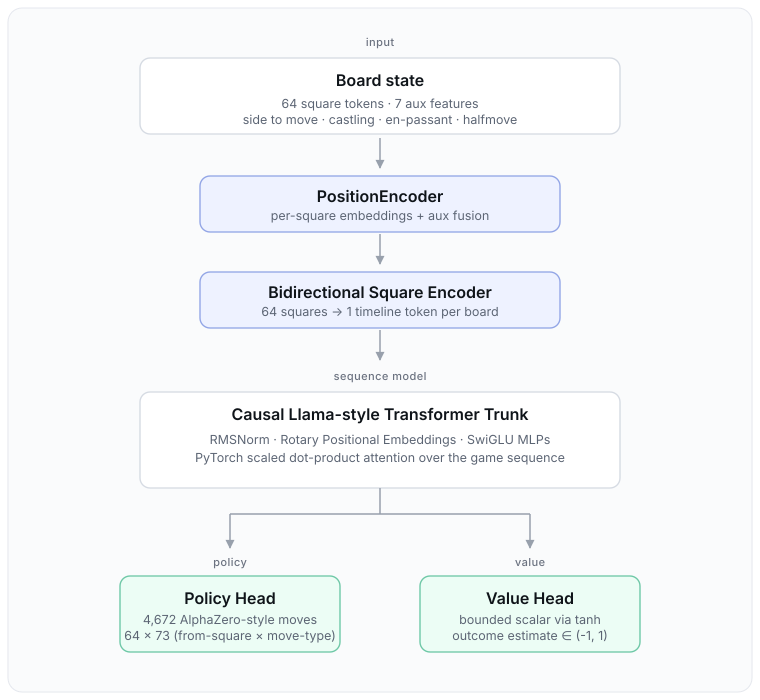
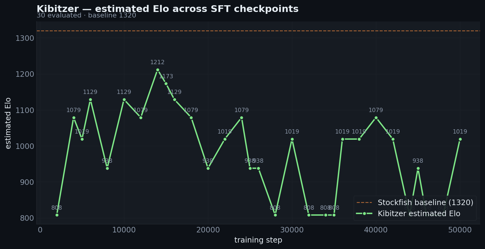

# kibitzer

> **kibitzer** *(n.)* — someone who watches a game and offers running commentary. fitting for a model that learns to play chess by watching positions unfold, one board at a time.

A chess policy/value model: board states as tokens, learns from game sequences, plays through policy + value predictions.

**[→ Checkpoints on Hugging Face (Kibitzer collection)](https://huggingface.co/collections/Pradheep1647/kibitzer-6a064b0094182a1620ada57f)**

## Architecture

<p align="center">
  
</p>

- **PositionEncoder** — embeds each board from 64 square tokens plus 7 aux features (side to move, castling, en-passant, halfmove clock).
- **Bidirectional Square Encoder** — collapses 64 squares into one timeline token per board.
- **Causal Llama-style trunk** — RMSNorm, rotary positional embeddings, SwiGLU MLPs, PyTorch scaled dot-product attention.
- **Policy head** — predicts one of 4,672 AlphaZero-style moves (64 × 73).
- **Value head** — bounded scalar outcome estimate via `tanh`.

Standalone architecture page: [`docs/architecture.html`](docs/architecture.html).

## Results

<p align="center">
  
</p>

Estimated Elo across SFT checkpoints, evaluated against a rated Stockfish baseline (1320).

## Run

```bash
uv run python scripts/train.py                          # train + push checkpoints
uv run python scripts/eval_and_rename_hf.py --from-hf   # eval HF checkpoints, rename with Elo
uv run pytest                                           # tests
```

Set `HF_USERNAME` and `HF_TOKEN` via environment or a local `.env`.
