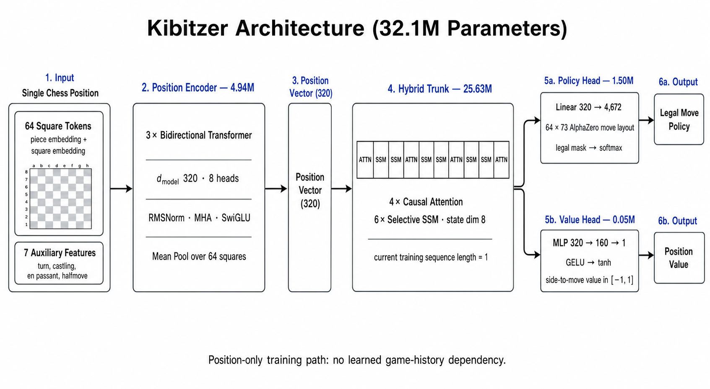

# kibitzer

> *a kibitzer is the guy who watches your chess game over your shoulder and tells you what to play. this model does the same thing, except it's actually useful.*

a 32.5m-param hybrid transformer + selective-SSM chess model. reads a board, spits out a policy (which move) and a value (who's winning). trained on lichess elite games, refined with az self-play, td-leaf, and on-policy distillation from lc0.

## architecture

```
board ──► [position encoder] ──► [alternating trunk] ──► policy (4672 moves)
                                attention / SSM   \──► value (tanh, [-1, 1])
```

| thing | value |
|---|---|
| d_model | 320 |
| trunk layers | 10 (4 causal attention, 6 selective SSM) |
| attention heads | 8 |
| ssm state dim | 8 |
| position encoding | 3-layer cross-attention (shaw) |
| max sequence | 128 (plies of history) |
| params | **32.5m** |
| value head | tanh-bounded, configurable depth |
| loss | policy CE + mse(value) |



the core idea: **attention is good at global reasoning, SSM is cheaper**. interleave them - every 3rd trunk block is attention, the rest are SSM. you get the benefits of both without paying full-attention cost across the whole sequence.

## what it does

given a board, run PUCT search (like alphazero) - the model provides priors for the search tree and evaluates leaf positions. the search returns the best move and visit counts.

```
                model (policy priors + value)
                         │
                         ▼
board ──► [PUCT search, N sims] ──► best move + visit distribution
```

## current state

### elo (search-based)

assessed against stockfish ladder, 64 sims PUCT:


| opponent (sf elo) | score | result |
|---|---|---|
| 1900 | 0.938 | 37W / 1D / 2L |
| 2100 | 0.850 | 31W / 6D / 3L |
| 2300 | 0.700 | 24W / 8D / 8L |
| 2500 | 0.525 | 13W / 16D / 11L |

estimated elo: **2483 ± 32** (search-based, 64 sims)

### scaling study

the attention-only backbone scales as a clean power law (S0 → S3, all on 5m positions):

| tag | params | policy ce | top-1 move match |
|---|---|---|---|
| S0 | 3.0m | 2.357 | 30.2% |
| S1 | 7.4m | 2.334 | 30.8% |
| S2 | 14.9m | 2.329 | 30.9% |
| S3 | 22.9m | 2.310 | 31.6% |


the raw policy ce keeps dropping with scale, but top-1 move match is flattening fast - we're hitting the human-move ceiling (~31-32%). the model correctly predicts the human move roughly a third of the time from 5m training positions. **more data helps more than more params.**

the production model (S2 shaw comp, 14.9m params) was trained on **142m positions** and is the one used in all gameplay evaluations below.

### az self-play

alphazero-style self-play: the model plays against itself using PUCT search with dirichlet root noise, trains on the visit distribution + game outcome, then we match the new model vs the old one.

| iter | vs base score | vs maia 2700 | notes |
|---|---|---|---|
| 1 | **0.625** | 0.100 | beats itself, regresses vs maia |
| 2 | killed | - | 400 sims too slow, see [decision.md](decision.md) |

the pattern: az improves the model against its own play style (0.625 h2h) but makes it *worse* against strong opponents (maia 2700: 0.100 vs base ref 0.225). classic self-play overfitting when the data is narrow - 80 games isn't enough diversity. the new config (200 games @ 200 sims) aims to fix this.

### on-policy distillation (lc0)

student plays its own games, lc0 labels each position. trains reverse-KL toward the teacher.


promising trajectory - the distilled model holds up decently against maia 2700. the teacher knowledge transfers well because the positions are from the student's own distribution.

### td-leaf value repair

self-play vs stockfish with online value-head training. curriculum ladder: 1320 → 1500 → 1700 → 1900.


crushed 1320-1700 easily, hit a wall at 1900 (rolling score ~0.35-0.45, never made it to 2100). the value head learns fast early on but plateaus when stockfish stops making tactical blunders. 200 games, 50 updates, ~15s/game.

### value head experiments


tl;dr: **offline metrics are liars**. the joint-from-scratch model won the value-decisive metric by +6.67pp, then tied/lost in actual games. blasting parameter count through the value head didn't budge play strength. [reports/value_head/REPORT.md](reports/value_head/REPORT.md)

## the messy part

thirty-five point-experiments (D1–D35) chasing one tweak at a time on one model size. none beat the 1320 baseline. every "improvement" measured offline. most of them didn't translate to actual play.

the full saga of bad decisions, dead ends, and what we learned: **[decision.md](decision.md)** and **[docs/scaling_study/README.md](docs/scaling_study/README.md)**

## roadmap

what we know works:
- **[scaling the backbone](docs/scaling_study/design.md)** (clean power law, more data > more params past ~15m)
- **[opd distillation](reports/opd/REPORT.md)** (lc0 teacher transfers well)
- **[more search sims](reports/search_depth/)** (= stronger play, but it's an inference crutch)

what we're trying next:
- **[az self-play](scripts/az_run.sh)** - 200 games @ 200 sims across 3 iterations, bigger data buffer
- **[td-leaf](scripts/train_tdleaf.py)** - needs more games or a different opponent (lc0? maia?)
- **bigger value head** - the 33k-param head is the known weak link, but the architecture experiments showed it's not that simple

## setup

```bash
uv sync
uv run pytest                    # 80 tests
bash scripts/az_run.sh           # start az self-play loop
uv run python scripts/train_bc.py -h  # supervised training
```

## checkpoints

| file | what | when |
|---|---|---|
| `runs/scaling_shaw_comp/S2_shaw_142M_comp.pt` | best supervised model (14.9m, 142m pos) | scaling sweep |
| `runs/az/az_iter_1.pt` | az iter 1 (one pass of self-play) | 2026-07-08 |

generated checkpoints are gitignored. hf push available via `scripts/eval_and_rename_hf.py`.

## citations

beyond the typical alphazero/deepmind stuff:
- [searchless chess](https://arxiv.org/abs/2402.04494) - 2895 elo with no search, 270m params, 15b positions
- [chinchilla scaling laws](https://arxiv.org/abs/2203.15556) - compute-optimal training
- [lc0](https://github.com/LeelaChessZero/lc0) - teacher for opd, eval opponent
- [maia](https://arxiv.org/abs/2006.01855) - human-like chess engine, used for eval