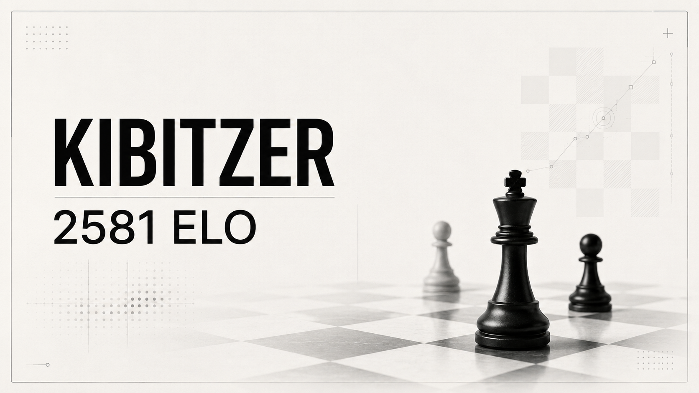
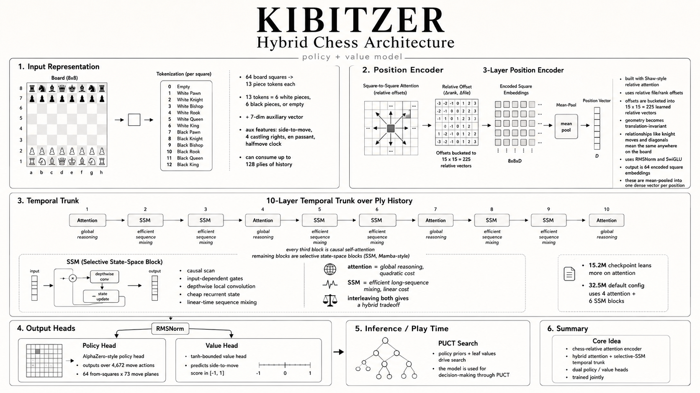
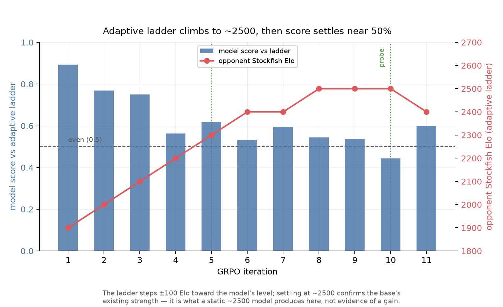
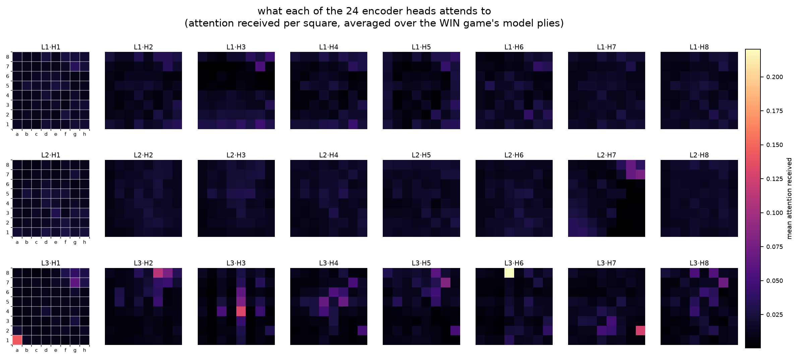

# kibitzer



chess is one of the games i'm fascinated by, so i constrained myself to a laptop rtx 4060 and asked how far i could push a small chess model. this repo is that experiment: a 15.2m-param attention-first policy/value model (a chess-relative attention encoder feeding a hybrid attention + selective-SSM trunk) trained on lichess elite games, evaluated with search, and iterated through dozens of failed and useful ideas. the honest headline is **2581 elo** on a proper stockfish-anchored tournament, everything trained on one consumer gpu.

(the codebase supports both attention-only and a transformer + selective-SSM hybrid, up to 32.5m params. the best trained checkpoint right now is 15.2m, attention-first, 142m positions -- that's what all the evals below use.)

## the name

a **kibitzer** (yiddish, from the german *kiebitzen*, "to look on at a card or chess game") is the onlooker who leans over the players' shoulders and offers unsolicited commentary on the best move. that is exactly what this model is. it never owns a game of its own; it watches a single position, forms an opinion, and tells you the move it would play. a spectator with a very strong opinion about your board.

## headline result

official tournament elo: Ordo-rated over 171 clean games against a stockfish `UCI_Elo` ladder (2200-3100), both colors, model wrapped in 512-sim PUCT, anchored sf-2500 = 2500.

| | rating | games | overall score |
|---|---:|---:|---:|
| **kibitzer @ 512 sims** | **2581.6 ± 102.3** | 171 | 42% |

it crushes sf-2200 and sf-2500, loses to sf-2700 and above, with the 50% crossover around sf-2600. read it as the strength of the model *with* search: deep PUCT is doing real work that does not distill back into the raw weights. full method, the whole ladder, and the honest caveats are in **[LOGBOOK.md](LOGBOOK.md)** (D67). a complementary searchless-ladder estimate (2483 ± 32 at 64 sims) is in [current state](#current-state) below.

## architecture



**how it works, end to end.** a position is not fed as pixels or a move list but as structured chess state: each of the 64 squares becomes one of 13 piece tokens (six white pieces, six black, or empty), alongside a 7-dim auxiliary vector holding side-to-move, the four castling rights, en passant, and the halfmove clock. the model can also consume a history of up to 128 plies, not just the current board.

the board first passes through a **3-layer position encoder** built on **Shaw-style relative attention**: instead of absolute square embeddings, every pair of squares attends through its file and rank offset, bucketed into 15x15 = 225 learned relative vectors that are folded into the attention bias (the Chessformer / Shaw form). this makes the geometry translation-invariant, so a knight-move or a diagonal relationship means the same thing wherever it sits on the board. the 64 encoded squares are then mean-pooled into a single dense vector per position, with RMSNorm and SwiGLU feed-forwards throughout.

those per-position vectors flow into a **10-layer trunk that runs over the ply history**, and this is exactly why "attention-only" undersells it: the trunk interleaves two block types. every third block is **causal self-attention** for global reasoning over the game so far; the rest are **selective state-space blocks** (SSM, Mamba-style), each a causal scan with input-dependent gates, a depthwise local convolution, and a cheap recurrent state that mixes the sequence in linear time. the bet is simple: attention is powerful but quadratic, SSM is cheap and linear, so interleave them and pay the full-attention cost only where it earns its keep. the best 15.2m checkpoint leans on the attention path; the default 32.5m config runs the full four-attention / six-SSM hybrid.

finally an RMSNorm feeds two heads: an **AlphaZero-style policy** over the fixed 4,672-move action space (64 from-squares x 73 move planes) and a **tanh-bounded value head** that outputs a side-to-move score in [-1, 1]. at play time those policy priors and leaf values drive a PUCT search. so it is not a single trick: a chess-relative attention encoder, a hybrid attention plus selective-SSM temporal trunk, and dual policy / value heads, trained together.

**current best checkpoint (all evals use this):**

| thing | value |
|---|---|
| d_model | 256 |
| trunk layers | 10 (all causal attention) |
| attention heads | 8 |
| position encoding | 3-layer cross-attention (shaw) |
| max sequence | 128 (plies of history) |
| params | **15.2m** |
| training data | 142m lichess elite positions |

**default config (code design, not yet trained at this size):**

| thing | value |
|---|---|
| d_model | 320 |
| trunk layers | 10 (4 attention, 6 selective SSM) |
| ssm state dim | 8 |
| params | **32.5m** |

the diagram above is the current code path, with exact parameter counts written into the figure.

## published model

strongest published checkpoint: **[`Pradheep1647/kibitzer-tactical-repair`](https://huggingface.co/Pradheep1647/kibitzer-tactical-repair)** (full model card: [`docs/hf_model_card.md`](docs/hf_model_card.md)).

base supervised checkpoint: **[`Pradheep1647/kibitzer-s2-shaw-142m-comp`](https://huggingface.co/Pradheep1647/kibitzer-s2-shaw-142m-comp)**.

| artifact | value |
|---|---|
| checkpoint | `tactical_repair.pt` |
| local path | `runs/tactical/tactical_repair.pt` |
| hf repo | [`Pradheep1647/kibitzer-tactical-repair`](https://huggingface.co/Pradheep1647/kibitzer-tactical-repair) |
| training objective | `tactical_supervised_repair_r1_policy_only` |
| eval setup | 128-sim PUCT vs Leela/Maia proxy unless stated otherwise |

## what it does

given a board, run PUCT search (like alphazero) - the model provides priors for the search tree and evaluates leaf positions. the search returns the best move and visit counts.


## current state

### elo (search-based)

assessed against stockfish ladder, 64 sims PUCT:


protocol: Stockfish was run with `UCI_LimitStrength` at fixed Elo settings; Kibitzer used the S2 Shaw 142m checkpoint plus 64 PUCT simulations per move. Score is `(wins + 0.5 * draws) / games` from Kibitzer's side. The Elo estimate is a fit over the ladder, not a raw-policy rating.

| opponent (sf elo) | score | result |
|---|---|---|
| 1900 | 0.938 | 37W / 1D / 2L |
| 2100 | 0.850 | 31W / 6D / 3L |
| 2300 | 0.700 | 24W / 8D / 8L |
| 2500 | 0.525 | 13W / 16D / 11L |

estimated elo: **2483 ± 32** (search-based, 64 sims)

read this as: with search enabled, the model is roughly even with the 2500 Stockfish setting under this specific ladder, and clearly above the 1900-2300 settings. it is not a standalone no-search rating, and it is not a claim about tournament engine strength outside this protocol. PGNs and JSON summaries live under `reports/scaling_law/elo_local/`.

### scaling study

the attention-first backbone scales as a clean power law (S0 → S3, all on 5m positions):

| tag | params | policy ce | top-1 move match |
|---|---|---|---|
| S0 | 3.0m | 2.357 | 30.2% |
| S1 | 7.4m | 2.334 | 30.8% |
| S2 | 14.9m | 2.329 | 30.9% |
| S3 | 22.9m | 2.310 | 31.6% |


the raw policy ce keeps dropping with scale, but top-1 move match is flattening fast - we're hitting the human-move ceiling (~31-32%). the model correctly predicts the human move roughly a third of the time from 5m training positions. **more data helps more than more params.**

the production model (S2 shaw comp, 14.9m params) was trained on **142m positions** and is the one used in all gameplay evaluations below.

### current repair branch

the strongest local checkpoint right now is **`runs/tactical/tactical_repair.pt`**. it is not a new published base yet; it is a tactical supervised repair on top of `policy_regret_repair.pt`.

paired 80-game gates vs the Leela/Maia-2700 proxy at 128 sims:

| checkpoint | W/D/L | score | implied elo |
|---|---:|---:|---:|
| `tactical_repair.pt` seed 17 | 7W / 25D / 48L | 0.244 | 2503 |
| `tactical_repair.pt` seed 23 | 12W / 23D / 45L | 0.294 | 2548 |
| `tactical_repair_r2.pt` seed 23 | 9W / 18D / 53L | 0.225 | 2485 |
| `policy_regret_repair.pt` seed 23 | 8W / 16D / 56L | 0.200 | 2459 |

takeaway: tactical R1 is the current best local branch. tactical R2 passed the held-out top-1 gate but failed the external gate, so it should not be promoted.

the branch tried next was **teacher-preference repair**: Stockfish/LC0-style rankings as
pairwise feedback, DPO/AWAC-style policy improvement from `tactical_repair.pt`, external gate as
the only promotion signal. it was rejected, the offline pair metrics did not transfer to play
(LOGBOOK.md D59). reproduce with:

```bash
bash scripts/run_preference_repair.sh
```

then gate it against tactical R1:

```bash
CANDIDATE_NAME=preference_repair \
CANDIDATE_CHECKPOINT=runs/preference/preference_repair.pt \
CANDIDATE_REPORT_DIR=reports/preference_repair \
SEED=31 \
bash scripts/run_repair_eval_gate.sh
```


folder-level plots:
- [repair eval rollup](reports/repair_eval/README.md)
- [tactical repair plots](reports/tactical_repair/README.md)
- [preference repair plots](reports/preference_repair/README.md)
- [regret repair plots](reports/regret/README.md)
- [regret-start plots](reports/regret_start/README.md)
- [az eval plots](reports/az/README.md)

### search budget sweep

D63 is the first clearly positive non-training signal after the repair/RL failures: the same
`tactical_repair.pt` checkpoint gets much stronger when PUCT is allowed to search deeper.
Only the simulation count changes; the opponent stays the Leela/Maia-2700 proxy at nodes=1.


| sims | W/D/L | score | implied proxy elo |
|---:|---:|---:|---:|
| 64 | 3 / 1 / 36 | 0.087 | 2293 |
| 128 | 6 / 11 / 23 | 0.287 | 2542 |
| 256 | 5 / 16 / 19 | 0.325 | 2573 |
| 512 | 29 / 8 / 3 | 0.825 | 2969 |

takeaway: the checkpoint was compute-starved at the 128-sim gate. 512 sims does not mean
the model itself is 2969 Elo; it means deep PUCT extracts a lot more strength against a
searchless external yardstick. the next confirmation is a rented-GPU 1024/2048 sweep against
2700 plus stronger Leela checkpoints. [full report](reports/sims_sweep/README.md).

the adaptive gate reuses one tree across 128/256/512/1024 checkpoints, records the real
simulation and time budget per move, and compares against uniform 512 search on paired openings:

```bash
bash scripts/run_adaptive_search_gate.sh
```

for the clean official tournament rating, run `bash scripts/run_official_elo.sh` (a cutechess
gauntlet vs the stockfish ladder, then Ordo). every PGN is checked for time forfeits, illegal
moves, malformed games, and incomplete runs; `bash scripts/rate_pgn.sh <pgn>` salvages a rating
from a finished run by dropping only the contaminated games. this is how the 2581 headline was
produced.

### az self-play

alphazero-style self-play: the model plays against itself using PUCT search with dirichlet root noise, trains on the visit distribution + game outcome, then we match the new model vs the old one.

| iter | vs base score | vs maia 2700 | notes |
|---|---|---|---|
| 1 | **0.625** | 0.100 | beats itself, regresses vs maia |
| 2 | killed | - | 400 sims too slow, see [LOGBOOK.md](LOGBOOK.md) |

the pattern: az improves the model against its own play style (0.625 h2h) but makes it *worse* against strong opponents (maia 2700: 0.100 vs base ref 0.225). classic self-play overfitting when the data is narrow - 80 games isn't enough diversity. the new config (200 games @ 200 sims) aims to fix this.

### on-policy distillation (lc0)

student plays its own games, lc0 labels each position. trains reverse-KL toward the teacher.


promising trajectory - the distilled model holds up decently against maia 2700. the teacher knowledge transfers well because the positions are from the student's own distribution.

### td-leaf value repair

self-play vs stockfish with online value-head training. curriculum ladder: 1320 → 1500 → 1700 → 1900.


crushed 1320-1700 easily, hit a wall at 1900 (rolling score ~0.35-0.45, never made it to 2100). the value head learns fast early on but plateaus when stockfish stops making tactical blunders. 200 games, 50 updates, ~15s/game.

### value head experiments

two separate experiments, same conclusion: the value head is not the bottleneck.

**joint-scratch (D30-D35):** trained policy + value together from a random init instead of the two-phase policy-then-value approach. the decisive-sign metric improved +6.67pp (65.95% → 72.62%). in actual play? tied-to-worse vs stockfish-1320 within the ±0.09 noise of a 20-game match.

**scaled value head (D52):** the value head is suspiciously thin: 33,025 params bolted onto a 15m trunk. enlarged it 4× to 131,841 params, froze the trunk, retrained against stockfish depth-14 labels.

| metric | legacy (33k) | enlarged (132k) | direction |
|---|---|---|---|
| offline mse (100m base) | 0.0403 | 0.0196 | **-51%, improved** |
| offline mse (142m comp) | 0.0569 | 0.0178 | **-69%, improved** |
| PUCT vs sf-1900 (100m) | 0.775 | 0.625 | **-15pp, regressed** |
| PUCT vs sf-1900 (142m comp) | 0.783 | 0.650 | **-13pp, regressed** |
| PUCT vs leela ~2700 | 0.225 | 0.150 | **-7.5pp, regressed** |

both experiments converged: offline metrics don't predict play. the value head is now a closed lever.


[full D52 report](reports/value_head/REPORT.md)

### rl fine-tuning (grpo + dppo)

D60 - genuine RL as the last non-scale lever. critic-free GRPO on an *external* verifiable reward (game outcome vs an adaptive stockfish elo ladder), with 128-sim searched rollouts, an exact total-variation DPPO trust region over the legal moves, and a KL anchor to the base. no self-play targets, no value critic - built specifically to dodge the "beats its own sibling, regresses vs real opponents" trap.



the adaptive ladder climbed 1900 → 2500 and the model held ~54% there. but that climb is exactly what a *static* 2500 model produces (the ladder only steps ±100/iter until it hits the model's level), so it confirms the base's strength, not a gain.


on the leela-2700 gate at the identical config as the base:

| checkpoint | W/D/L | score | implied elo |
|---|---|---|---|
| grpo_v5 (best) | 12/20/48 | 0.275 | ~2532 |
| tactical_repair (base) | 12/23/45 | 0.294 | ~2548 |

flat within noise - identical wins (12=12), three base draws turned into losses. the fixed-opponent probe@2000 was flat too (0.9125 → 0.900). GRPO held the model's strength but added nothing externally: the 9th non-scale lever to hold-or-lose against the external yardstick. [full plots + report](reports/grpo/README.md).

### looking inside (interpretability)

not a strength experiment. a mechanistic-interp pass on the base: replay real leela-2700 games (win/draw/loss), hook every position, and watch how it reasons. findings: head specialization only shows up in the last encoder layer, there's a fixed d8 "attention-sink" head, the mean-pool crushes per-square activation norm from ~79 to ~2 (a real bottleneck, and an argument for attention pooling), and the value head lands on the right sign but noisily and late. includes side-by-side board + attention videos per game.



[full interp study, figures, and videos](interp/README.md)

## experiment log

this repo is closer to a lab notebook than a clean model release. the short version:

| line | result |
|---|---|
| scaling/data | worked best; data mattered more than more params past ~15m |
| search depth | strongest live positive signal; 512 sims jumped from 0.287 to 0.825 vs the Leela-2700 proxy |
| az self-play | beat its own base, regressed vs maia/leela-style opponents |
| td-leaf | fixed easy curriculum rungs, stalled around 1900 |
| value-head repair | improved offline value metrics, regressed real play |
| tactical repair | small external gain; R1 kept, R2 rejected |
| teacher-preference repair | first DPO-style attempt rejected; offline pair metrics did not transfer |
| grpo + dppo rl (D60) | neutral; searched rollouts + trust region held ~2500 strength, no external gain (0.275 vs base 0.294) |
| joint scratch / point tweaks | mostly negative or inconclusive |

the longer failure log is in **[LOGBOOK.md](LOGBOOK.md)**; the scaling summary is in **[docs/scaling_study/README.md](docs/scaling_study/README.md)**.

## roadmap

what actually moved external strength:
- **[scaling the backbone](docs/scaling_study/design.md)** (clean power law, more data > more params past ~15m)
- **[more search sims](reports/sims_sweep/README.md)** (stronger play, but it is an inference crutch that does not distill into the weights)

what got tested and closed (full autopsy in **[LOGBOOK.md](LOGBOOK.md)**, D48-D67): teacher-preference repair, az self-play (including 512-sim expert iteration), on-policy lc0 distillation, td-leaf, value-head enlargement, grpo/dppo rl, and oracle process-reward repair. every one of them held or lost strength against a fixed external opponent. the only lever with a positive slope still open is parameter and data scale, and that is a deliberate not-now: the whole point was the ceiling of a small model on a laptop, and **2581 elo is that ceiling, honestly measured.**

## setup

```bash
uv sync
uv run pytest                    # 80 tests
bash scripts/az_run.sh           # start az self-play loop
bash scripts/run_preference_repair.sh  # current repair branch
uv run python scripts/train_bc.py -h  # supervised training
```

## checkpoints

| file | what | when |
|---|---|---|
| `runs/scaling_shaw_comp/S2_shaw_142M_comp.pt` | best supervised model (14.9m, 142m pos) | scaling sweep |
| `runs/az/az_iter_1.pt` | az iter 1 (one pass of self-play) | 2026-07-08 |
| `runs/tactical/tactical_repair.pt` | best local repair branch; tactical R1 | 2026-07-09 |
| `runs/tactical/tactical_repair_r2.pt` | rejected tactical R2; worse external gate | 2026-07-09 |

generated checkpoints are gitignored. the strongest published checkpoint is on [Hugging Face](https://huggingface.co/Pradheep1647/kibitzer-tactical-repair); hf push support lives in `kibitzer/hf_utils.py`.

## license

MIT, see [LICENSE](LICENSE). the model weights are trained on public lichess elite games and released under the same terms.

## citations

this is the paper trail behind the architectures and experiments in this repo. it includes
ideas that worked, ideas that failed their gate, and papers that directly shaped those tests.

### chess systems and human models

- [alphazero](https://arxiv.org/abs/1712.01815) - self-play policy/value learning with puct search
- [searchless chess](https://arxiv.org/abs/2402.04494) - 2895 elo with no search, 270m params, 15b positions
- [knightcap](https://arxiv.org/abs/cs/9901002) - early learned chess evaluation combined with tree search
- [maia](https://arxiv.org/abs/2006.01855) - human move prediction at rating-specific skill levels
- [maia-2](https://arxiv.org/abs/2409.20553) - one human-aligned model spanning skill levels
- [maia-3](https://github.com/CSSLab/maia3) ([paper](https://openreview.net/forum?id=2ltBRzEHyd)) - chessformer-based human move prediction across skill levels
- [allie](https://arxiv.org/abs/2410.03893) - human-aligned chess with time-adaptive search
- [maia4all](https://arxiv.org/abs/2507.21488) - efficient individual human-behavior adaptation
- [unimaia](https://arxiv.org/abs/2605.27767) - language-steered human-like chess policy control
- [chessmimic](https://arxiv.org/abs/2606.04473) - per-rating move, clock, and outcome transformers
- [elo-disentangled style embeddings](https://arxiv.org/abs/2606.25176) - player-style modeling using maia-3 policy logits

### architecture and scaling

- [attention is all you need](https://arxiv.org/abs/1706.03762) - transformer attention backbone
- [self-attention with relative position representations](https://arxiv.org/abs/1803.02155) - the Shaw relative-attention form used by the board encoder
- [mastering chess with a transformer model](https://arxiv.org/abs/2409.12272) - the earlier chessformer position-representation study behind the shaw ablation
- [mamba](https://arxiv.org/abs/2312.00752) - selective state spaces behind the lightweight ssm blocks
- [rmsnorm](https://arxiv.org/abs/1910.07467) - normalization used throughout the model
- [glu variants improve transformer](https://arxiv.org/abs/2002.05202) - the swiglu feed-forward form
- [kaplan scaling laws](https://arxiv.org/abs/2001.08361) - the original loss-versus-scale methodology
- [chinchilla scaling laws](https://arxiv.org/abs/2203.15556) - compute-optimal parameter/data allocation

### search, distillation, and reinforcement learning

- [tdleaf(lambda)](https://arxiv.org/abs/cs/9901001) - temporal-difference learning through game-tree leaves
- [proximal policy optimization](https://arxiv.org/abs/1707.06347) - clipped policy optimization baseline
- [advantage-weighted regression](https://arxiv.org/abs/1910.00177) - supervised-looking off-policy policy improvement
- [awac](https://arxiv.org/abs/2006.09359) - advantage-weighted actor-critic with offline data
- [generalized knowledge distillation](https://arxiv.org/abs/2306.13649) - on-policy distillation from student-generated states
- [direct preference optimization](https://arxiv.org/abs/2305.18290) - pairwise preference learning without a separate reward model
- [conservative q-learning](https://arxiv.org/abs/2006.04779) - offline-rl protection against optimistic out-of-distribution values
- [reinforced self-training](https://arxiv.org/abs/2308.08998) - generate, score, filter, and reuse model samples
- [deepseekmath / grpo](https://arxiv.org/abs/2402.03300) - group-relative policy optimization without a learned critic
- [dppo](https://arxiv.org/abs/2602.04879) - divergence-constrained trust regions used in the grpo experiment
- [maximum likelihood reinforcement learning](https://arxiv.org/abs/2602.02710) - maxrl for sparse verifiable rewards
- [post-training insights from learning chess](https://arxiv.org/abs/2507.00726) - grpo reward design and chess-specific post-training evidence
- [policy gradient search](https://arxiv.org/abs/1904.03646) - online planning and expert iteration without a search tree
- [gumbel muzero](https://openreview.net/forum?id=bERaNdoegnO) - gumbel action sampling and sequential-halving search
- [search-contempt](https://arxiv.org/abs/2504.07757) - compute-aware self-play search for alphazero-like engines
- [pgx](https://arxiv.org/abs/2303.17503) - hardware-accelerated parallel game simulation for rl

### software reference

- [lc0](https://github.com/LeelaChessZero/lc0) - teacher for on-policy distillation and the fixed external opponent
