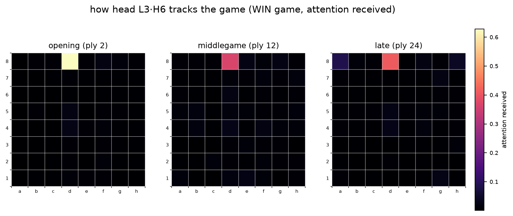
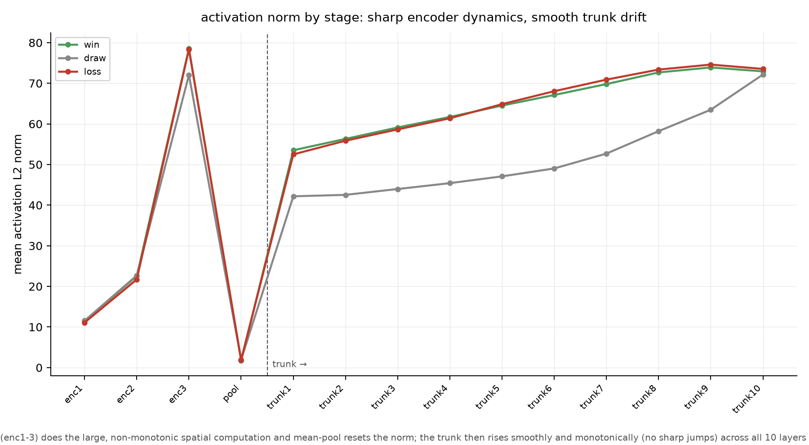
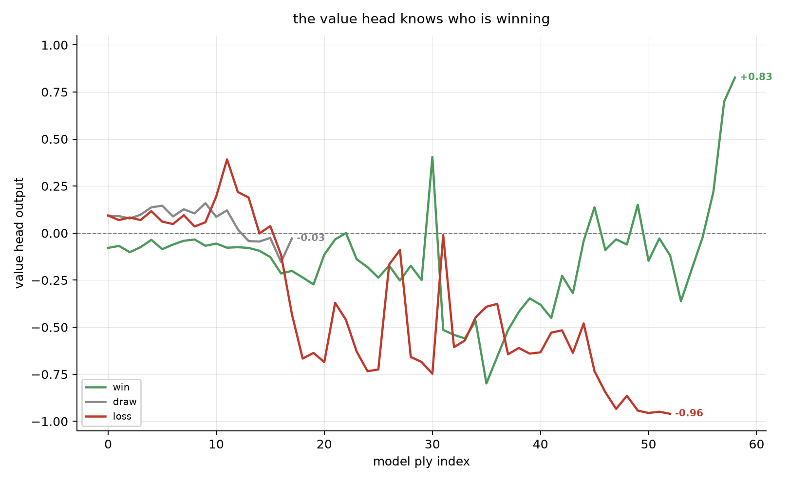
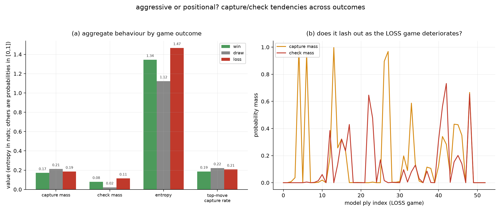

# peeking inside the base model

I spent a while trying to make this 15.2M chess net stronger, RL, self play, distillation, the whole post training buffet that X keeps insisting will get you to AGI by next Tuesday. None of it moved the needle. So I did the thing you do when you run out of levers: stop trying to change the model and start asking what it actually learned. This folder is that. Not "how strong is it" (we know, ~2500 to 2600 Elo, hard ceiling), but "what is going on inside its head when it plays".

The rule I set: no new games. We already have games it played against **Leela/Maia-2700**, so I picked three, one win, one draw, one loss, all against the same opponent, and replayed every position back through the network with forward hooks. So this is the model's real behaviour on real positions, not a synthetic probe.

Quick recap of what we are looking into. The model is a *single position* net (`ctx=1`, it literally cannot see the game history, this was a deliberate call because chess is Markovian). A board goes in as 64 square embeddings plus a few aux features, a **3 layer, 8 head Shaw relative attention encoder** thinks about the 64 squares, a **mean pool** squashes all 64 into one vector, then a 10 layer trunk and the policy and value heads finish the job. Because it is single position, basically all the real chess reasoning has to happen in those 3 encoder layers. Which is convenient, because that is exactly the thing you can draw a heatmap of.

Data source: `reports/tactical_repair/tactical_repair_r1_vs2700_s128_g80_seed23.{pgn,jsonl}`.

---

## the videos (board on the left, what it is looking at on the right)

Left is the game, played move highlighted. Right is the **layer 3 attention**, i.e. which squares the last encoder layer is actually paying attention to, synced move by move.

<video src="figures/game_win.mp4" controls width="720"></video>

*Win, model was Black, 59 moves. [figures/game_win.mp4](figures/game_win.mp4)*

<video src="figures/game_draw.mp4" controls width="720"></video>

*Draw, model was White, 18 moves. [figures/game_draw.mp4](figures/game_draw.mp4)*

<video src="figures/game_loss.mp4" controls width="720"></video>

*Loss, model was White, 53 moves. [figures/game_loss.mp4](figures/game_loss.mp4)*

The nice part is the right panel is not a static blob. The focus tightens onto the active files and onto the square being played, you can watch it lock onto a d4/e3/d2 cluster exactly when a pawn breaks there. One head, though, just stares at a back rank square the entire game and refuses to do anything else. More on that guy below.

---

## what we found

### 1. the encoder does nothing interesting until the last layer


Here is the key insight: layers 1 and 2 are almost maximally **diffuse**. Attention entropy sits around 4.0 to 4.1 out of a hard ceiling of 4.16, which is a fancy way of saying the early heads smear their attention across the whole board and commit to nothing. Then layer 3 wakes up. Heads specialize onto the **central d and e files** (L3H2 and L3H3 camp on d4/d7, one locks the e file), others cover ranks 6 to 8. So the model builds a vague board wash first and only decides what matters at the very end of the encoder. Three layers, and two of them are mostly vibes.

### 2. there is a head that attends to exactly one square, forever


**L3H6 puts about 0.63 of its attention on d8 at move 2, and it is still parked on d8 in the late middlegame.** It does not track the action, it does not care what is happening, it found d8 in the opening and emotionally committed. This is an *attention sink*, the same phenomenon everyone on X rediscovered when StreamingLLM and the "massive activations" papers made the rounds, except here it is a chess net doing it instead of a 70B language model. One of eight layer 3 heads, drawing a full salary, watching d8. Candidate to prune or repurpose the moment we retrain.

### 3. the mean pool is where information goes to die


Watch the activation norm. It builds through the encoder, roughly 11, then 22, then 79. Then the `.mean()` over the 64 squares collapses it to about 2. Two. All that per square structure the encoder just spent three layers building gets averaged into a puddle before the heads ever see it. Turns out you cannot delete 98% of the magnitude and expect the tactics to survive. This is the single strongest argument for the planned fix: kill the mean pool, use attention pooling or keep the per square tokens, so the structure actually reaches the output.

An honest correction, because I said something wrong earlier and the tone guide says dead ends stay in. I assumed the trunk was idle. It is not. After the pool bottleneck it re inflates the vector back up, roughly 50 to 74 across its ten layers. But at `ctx=1` it cannot do attention across positions (there is only one position), so it is acting as extra pointwise depth on a single squashed vector, not reasoning. So the lever is the encoder and the pool, not "rip out the trunk".

### 4. the value head knows the result, eventually, once it stops second guessing


Final value reads +0.83 for the win, -0.03 for the draw, -0.96 for the loss. Correct sign every single time, and it is gloomy throughout the loss (mean -0.38), so it saw it coming. The catch: it is a **noisy, late** signal, not a clean running eval. The win sits negative for about 50 plies and only flips positive in the last 8 moves. It is the "it's so over" to "we're so back" pipeline compressed into one game. This is also why every value repair experiment I ran went nowhere, the value head is a weak scalar bolted onto a good policy, and now you can watch it be weak in real time.

### 5. it is a grinder that panics with checks when it is losing


Across all three games only about 19 to 22% of its top moves are captures. It is **positional, not a slugger**, no matter what X thinks every engine should look like. The interesting tell is the loss: entropy is highest (1.47 vs 1.34 win, 1.12 draw, so it is least sure of itself), and check pressure roughly doubles the win game and is 5x the draw (check mass 0.11 vs 0.08 vs 0.02), with the biggest check spikes clustering in the second half as the position falls apart. Mild desperation checks, basically. The draw is its calmest game, lowest entropy, value glued near zero, a quiet handshake.

### 6. search overrides the raw policy about a quarter of the time
The move actually played (128 sim PUCT) matches the raw policy's first instinct only 72 to 78% of the time. So one move in four, search looks at what the network wanted and says "no". That gap is the entire reason search is in the loop.

---

## reproduce

```bash
uv run python interp/analyze.py       # hook, replay, dump activations and attention -> interp/data/
uv run python scripts/plot_interp.py  # the five figures -> interp/figures/fig*.png
uv run python interp/video.py         # the side by side videos -> interp/figures/game_*.mp4
```

## caveats, because I am not going to pretend this is a paper

- Three games, one opponent. This is qualitative, not a statistical claim over all games.
- The attention maps are the exact Shaw distribution, recomputed by hand from each block's weights because `F.scaled_dot_product_attention` throws the weights away. The board views reduce a head's 64x64 map to attention received per square (mean over queries).
- Some of the recurring hot squares come partly from the learned Shaw relative position bias, not only the specific position. I flagged it, I did not over read it.
- The value and behaviour numbers are per model ply aggregates in `interp/data/summary.json`.

Two of these findings, the mean pool puddle and the sink head, are not just trivia. They point straight at the next architecture move (deeper encoder, real pooling), which means the interp actually earned its keep instead of being a pretty poster. Scale might still be all you need, but at least now I know where the model is wasting its capacity.
