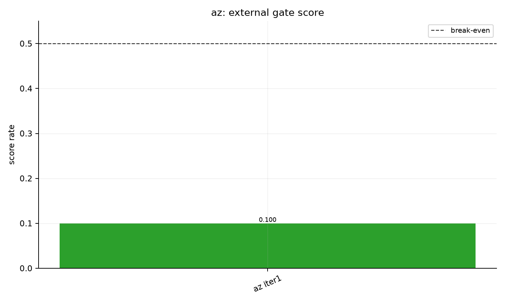
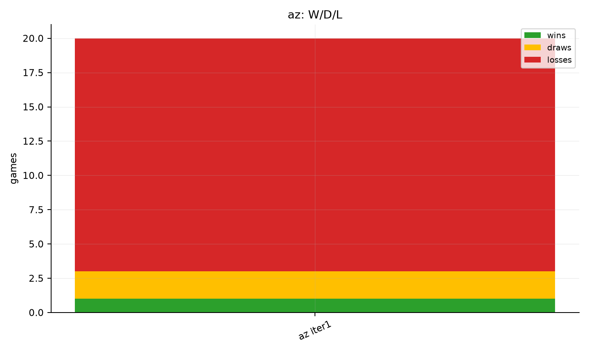
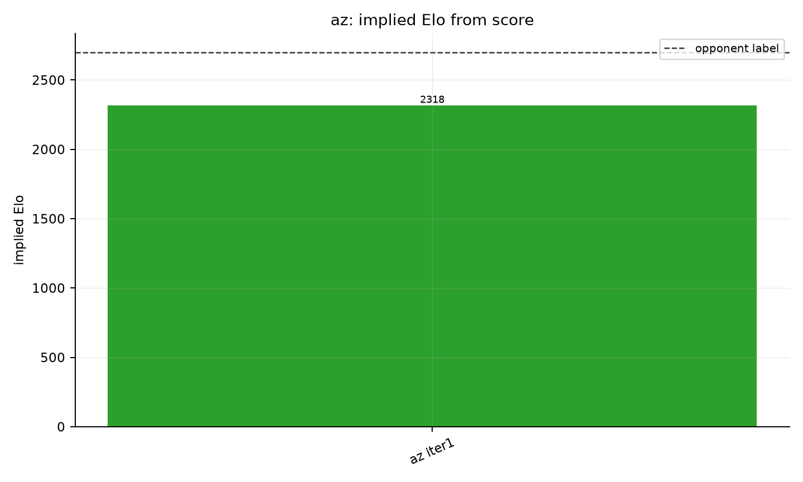

# az eval report

Best score here: `az iter1` at `0.100` (1W/2D/17L), implied Elo `2318`.

## Figures

- 
- 
- 

## Matches

| run | games | W/D/L | score rate | Elo delta | implied Elo | source |
|---|---:|---:|---:|---:|---:|---|
| az iter1 | 20 | 1/2/17 | 0.100 | -382 | 2318 | `az_iter1_vs2700.jsonl` |
