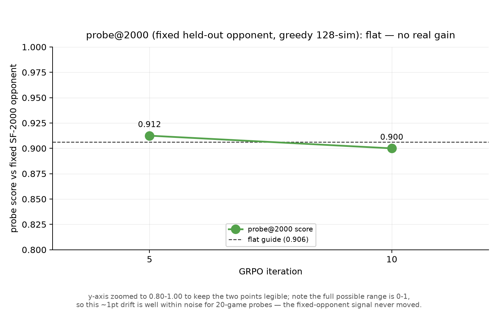
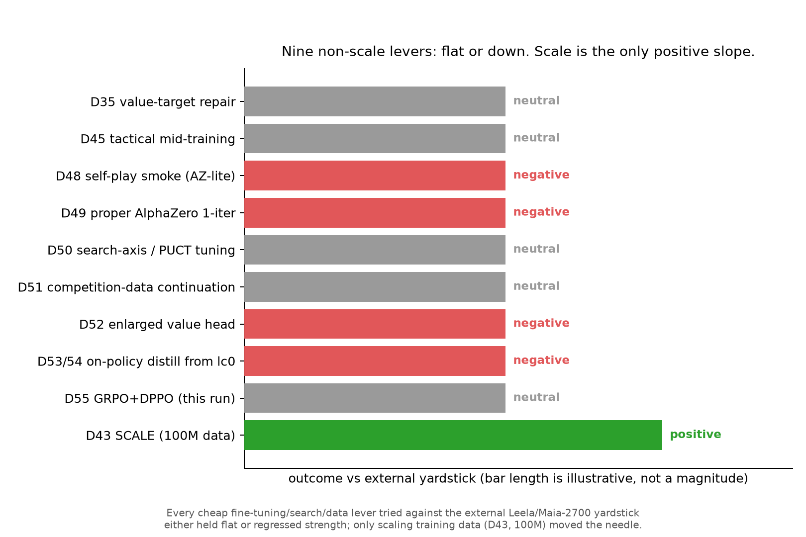

# D55 GRPO+DPPO report

Figures for the GRPO + exact-divergence DPPO RL fine-tuning run on the 15.2M tactical_repair checkpoint (~2500 Elo), trained against an adaptive Stockfish Elo ladder with searched (128-sim PUCT) rollouts, a DPPO total-variation trust region, and a KL anchor to the base.

## Verdict

- External gate vs Leela/Maia-2700 (80 games, 128 sims, seed 23): `grpo_v5` scores 0.275 (12W/20D/48L) vs base `tactical_repair` 0.294 (12W/23D/45L). Both far below the 0.324 promotion bar (base + 0.03); win counts are identical, only 3 draws flip to losses — the gap is noise, not signal. **Not promoted.**
- The fixed-opponent probe@2000 is flat across training (0.9125 at iter 5, 0.900 at iter 10) — the one honest signal in the run shows no real gain.
- The adaptive ladder climbing to ~2500 Elo and the score settling near 50% there is consistent with the base's pre-existing strength, not with the run producing a stronger model.
- The ceiling estimate (~2500-2600 Elo) stands: this is the 9th non-scale lever to land flat or negative; scale (D43) remains the only positive lever found so far.

## Figures

- **fig1_ladder_climb.png** — Per-iteration model score vs the adaptive ladder Elo; the ladder climbs to ~2500 while score settles near 50%, confirming the base's existing level rather than a gain.
  
- **fig2_probe_flat.png** — The fixed-opponent probe@2000 at iterations 5 and 10 (0.9125, 0.900) — flat, the honest read on whether training produced real improvement.
  
- **fig3_external_gate.png** — The decisive comparison vs Leela/Maia-2700: score bars against the promotion threshold, plus a W/D/L breakdown showing identical win counts for grpo_v5 and base.
  
- **fig4_nonscale_ledger.png** — Ledger of every non-scale lever tried (D35 through D55) vs the external yardstick; nine land flat or negative, only scale (D43) is positive.
  

## Rebuild

```bash
uv run python scripts/plot_grpo_report.py
```
