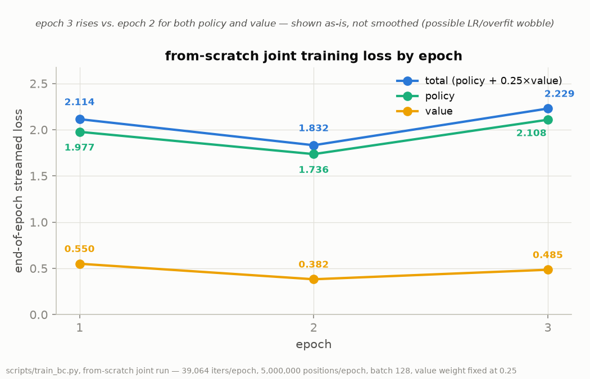
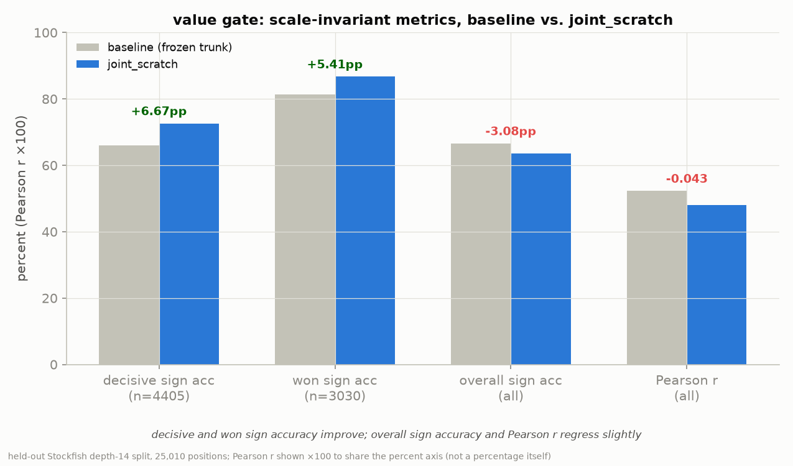
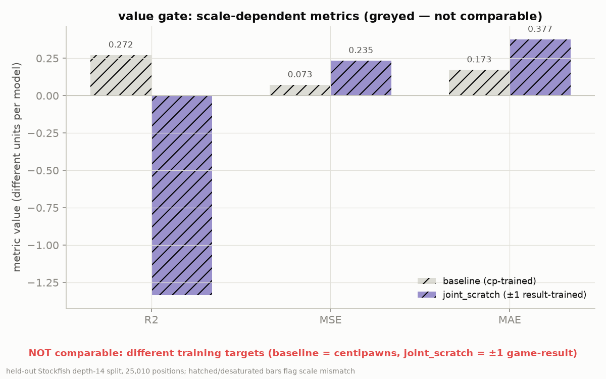

# Joint-scratch report

Regenerated from a from-scratch joint policy+value distillation run
(`scripts/train_bc.py`), with the value target set to ±1 game-result (not
Stockfish centipawns) and a fixed joint value weight of 0.25. This is the
first attempt at training the value head jointly from a random init, rather
than freezing a policy-only trunk and bolting on a separately-trained value
head.

## Headline finding

Joint-scratch training is the first lever that breaks the ~66% decisive-sign
wall that every prior value-head attempt got stuck at: decisive-position sign
accuracy goes from 65.95% (frozen-trunk baseline) to 72.62% (+6.67pp), and
won-position sign accuracy goes from 81.32% to 86.73% (+5.41pp). This comes
at the cost of near-equality overall Pearson correlation (0.5226 → 0.4796)
and overall sign accuracy (66.58% → 63.50%), both slight regressions. Because
the value target changed from cp-regression to ±1 game-result, R²/MSE/MAE are
not directly comparable between the two models and are reported separately,
clearly labeled.

The decisive test — whether this value head actually helps PUCT search beat
the baseline — is a search gate, run separately (not included here).

## Figures

### Training loss by epoch

End-of-epoch streamed total/policy/value loss over 3 epochs of joint
from-scratch training. Epoch 3 rises for both policy and value relative to
epoch 2 — shown honestly rather than smoothed; likely an LR or overfit
wobble.

### Value gate: scale-invariant metrics

Decisive/won/overall sign accuracy and Pearson r, baseline vs. joint_scratch,
on the same held-out Stockfish depth-14 split (25,010 positions). These are
scale-invariant and directly comparable — decisive and won sign accuracy
improve, overall sign accuracy and Pearson r regress slightly.

### Value gate: scale-dependent metrics

R²/MSE/MAE for the same two models, shown hatched/desaturated and explicitly
labeled **not comparable**: the baseline was trained to regress Stockfish
centipawns, joint_scratch was trained to regress ±1 game-result, so these
metrics live on different scales and cannot be read as a head-to-head
comparison.
