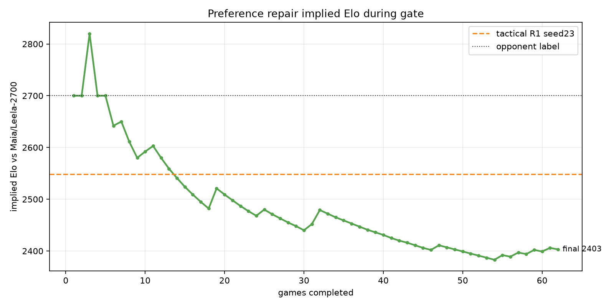
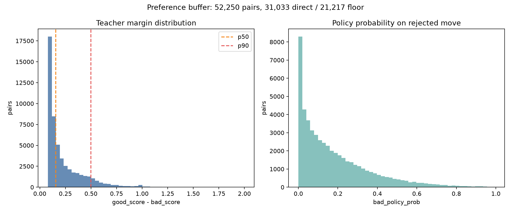
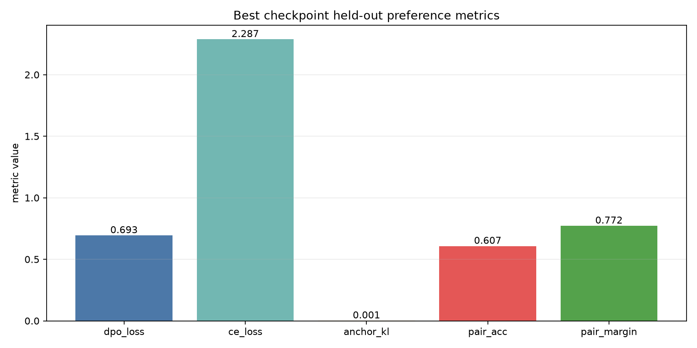

# Preference repair report

## Verdict

- Rejected. The external gate regressed hard against the current tactical R1 checkpoint.
- Gate stopped at 62/80 games: 3W/13D/46L, score rate 0.153, implied Elo 2403.
- Tactical R1 reference is score rate 0.294, implied Elo 2548. Preference repair was already below the promotion band.
- Offline preference metrics improved enough to save a checkpoint, but they did not predict external play.
- Conservative anchor retry also failed: 62/80 stopped, 4W/17D/41L, score rate 0.202, implied Elo 2461.

## Figures

These plots were generated for the first preference repair checkpoint. The
anchor retry was logged without regenerating plots.

- 
- 
- 
- 

## Buffer

| pairs | margin mean | margin p50 | margin p90 | bad-policy-prob mean | floor bad score |
|---:|---:|---:|---:|---:|---:|
| 52,250 | 0.236 | 0.154 | 0.497 | 0.184 | 21,217 |

## Offline Best Checkpoint

| metric | value |
|---|---:|
| `dpo_loss` | 0.6934 |
| `ce_loss` | 2.2871 |
| `anchor_kl` | 0.0009 |
| `pair_acc` | 0.6070 |
| `pair_margin` | 0.7716 |

## Next Command

No next command for this branch. The conservative retry below was already tried
and rejected:

```bash
ACTION=train \
PREFERENCE_JSONL=runs/preference/r1_teacher_pairs_sf12.jsonl \
OUTPUT_CHECKPOINT=runs/preference/preference_repair_anchor_r1.pt \
LEARNING_RATE=3e-6 \
EPOCHS=1 \
BETA=0.03 \
CE_WEIGHT=0.5 \
ANCHOR_WEIGHT=0.5 \
bash scripts/run_preference_repair.sh
```

Stopped-run evidence for that retry:

- `preference_repair_anchor_r1_vs2700_s128_g80_seed31_stopped62.jsonl`
- `preference_repair_anchor_r1_vs2700_s128_g80_seed31_stopped62.log`
- `preference_repair_anchor_r1_vs2700_s128_g80_seed31_stopped62.pgn`

The generic `preference_repair_vs2700_s128_g80_seed31.*` files currently also
reflect the last stopped anchor retry because the gate command reused the same
candidate/report stem.
