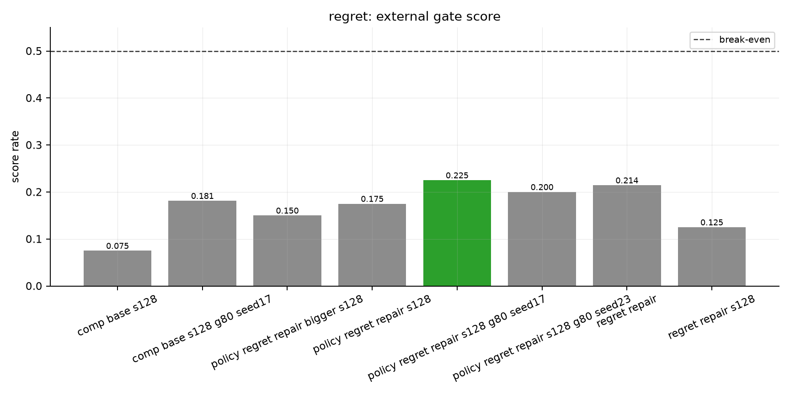
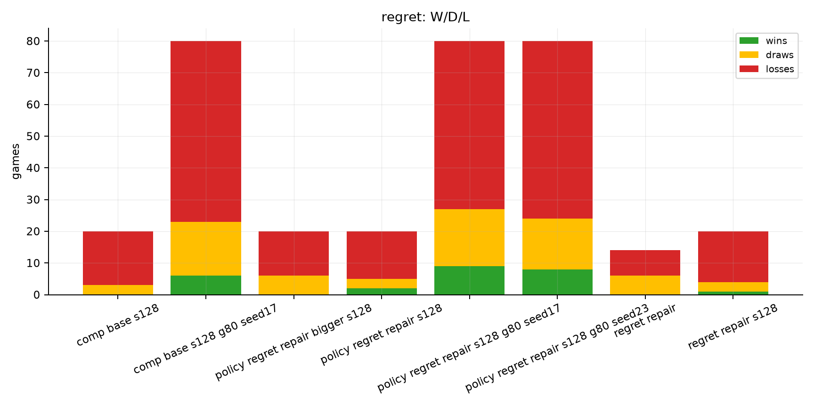
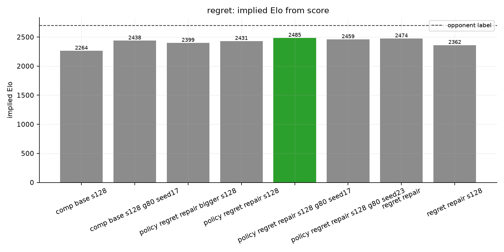

# regret eval report

Best score here: `policy regret repair s128 g80 seed17` at `0.225` (9W/18D/53L), implied Elo `2485`.

## Figures

- 
- 
- 

## Matches

| run | games | W/D/L | score rate | Elo delta | implied Elo | source |
|---|---:|---:|---:|---:|---:|---|
| comp base s128 | 20 | 0/3/17 | 0.075 | -436 | 2264 | `comp_base_vs2700_s128.jsonl` |
| comp base s128 g80 seed17 | 80 | 6/17/57 | 0.181 | -262 | 2438 | `comp_base_vs2700_s128_g80_seed17.jsonl` |
| policy regret repair bigger s128 | 20 | 0/6/14 | 0.150 | -301 | 2399 | `policy_regret_repair_bigger_vs2700_s128.jsonl` |
| policy regret repair s128 | 20 | 2/3/15 | 0.175 | -269 | 2431 | `policy_regret_repair_vs2700_s128.jsonl` |
| policy regret repair s128 g80 seed17 | 80 | 9/18/53 | 0.225 | -215 | 2485 | `policy_regret_repair_vs2700_s128_g80_seed17.jsonl` |
| policy regret repair s128 g80 seed23 | 80 | 8/16/56 | 0.200 | -241 | 2459 | `policy_regret_repair_vs2700_s128_g80_seed23.jsonl` |
| regret repair | 14 | 0/6/8 | 0.214 | -226 | 2474 | `regret_repair_vs2700.jsonl` |
| regret repair s128 | 20 | 1/3/16 | 0.125 | -338 | 2362 | `regret_repair_vs2700_s128.jsonl` |
