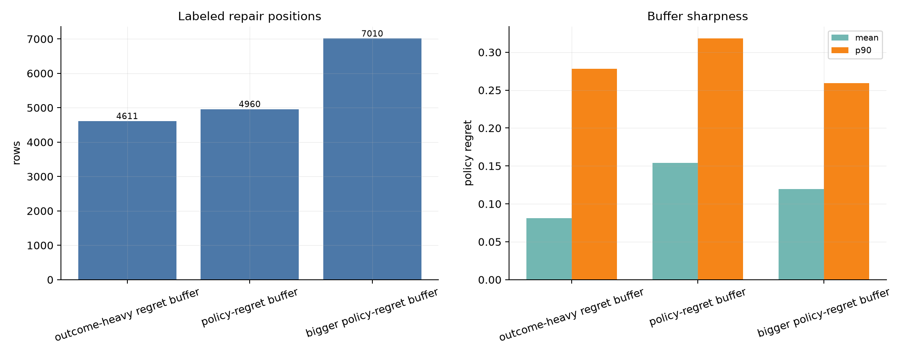
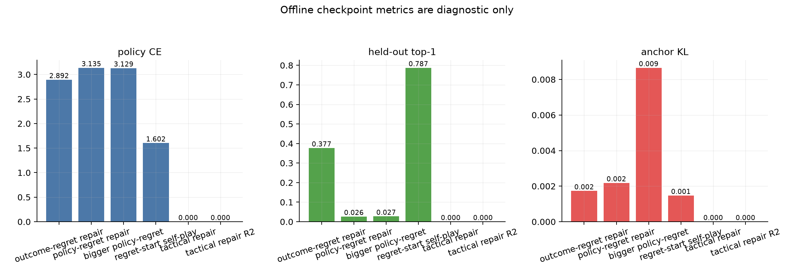

# Repair evaluation report

This folder is the decision report for the recent repair branches. It uses the cheap external gates we already ran, plus the local repair buffers/checkpoints.

## Verdict

- Current best: `tactical R1 (80g s23)` at score rate `0.294` (12W/23D/45L).
- Best paired 80-game gate: `tactical R1 (80g s23)` at score rate `0.294`, implied Elo `2548`.
- Tactical R1 remains the current best; tactical R2 passed held-out top1 but regressed externally, so do not promote R2.
- The broader policy-regret buffer did not beat the first policy-regret checkpoint.
- Regret-start self-play fell back to the comp-base score band, so it stays closed unless continuation states get external teacher labels.

## Figures

- 
- 
- 
- 
- 

## External gates

| run | sims | games | W/D/L | score rate | Elo delta | implied Elo | source | note |
|---|---:|---:|---:|---:|---:|---:|---|---|
| comp base (20g) | 128 | 20 | 0/3/17 | 0.075 | -436 | 2264 | `reports/regret/comp_base_vs2700_s128.jsonl` | direct base rerun |
| comp base (80g) | 128 | 80 | 6/17/57 | 0.181 | -262 | 2438 | `reports/regret/comp_base_vs2700_s128_g80_seed17.jsonl` | paired 80-game gate |
| AZ iter 1 | 64 | 20 | 1/2/17 | 0.100 | -382 | 2318 | `reports/az/az_iter1_vs2700.jsonl` | old AZ self-play check |
| outcome-regret repair | 128 | 20 | 1/3/16 | 0.125 | -338 | 2362 | `reports/regret/regret_repair_vs2700_s128.jsonl` | value/outcome-heavy repair |
| policy-regret (20g) | 128 | 20 | 2/3/15 | 0.175 | -269 | 2431 | `reports/regret/policy_regret_repair_vs2700_s128.jsonl` | first policy-regret probe |
| policy-regret (80g) | 128 | 80 | 9/18/53 | 0.225 | -215 | 2485 | `reports/regret/policy_regret_repair_vs2700_s128_g80_seed17.jsonl` | paired 80-game gate |
| policy-regret (80g s23) | 128 | 80 | 8/16/56 | 0.200 | -241 | 2459 | `reports/regret/policy_regret_repair_vs2700_s128_g80_seed23.jsonl` | paired 80-game gate, seed 23 |
| bigger policy-regret | 128 | 20 | 0/6/14 | 0.150 | -301 | 2399 | `reports/regret/policy_regret_repair_bigger_vs2700_s128.jsonl` | broader buffer, longer train |
| regret-start self-play | 128 | 20 | 1/1/18 | 0.075 | -436 | 2264 | `reports/regret_start/regret_start_az_vs2700_s128.jsonl` | targeted self-play |
| tactical repair (20g) | 128 | 20 | 2/6/12 | 0.250 | -191 | 2509 | `reports/tactical_repair/tactical_repair_vs2700_s128.jsonl` | first tactical probe |
| tactical repair (80g) | 128 | 80 | 7/25/48 | 0.244 | -197 | 2503 | `reports/tactical_repair/tactical_repair_vs2700_s128_g80_seed17.jsonl` | paired 80-game gate |
| tactical R1 (80g s23) | 128 | 80 | 12/23/45 | 0.294 | -152 | 2548 | `reports/tactical_repair/tactical_repair_r1_vs2700_s128_g80_seed23.jsonl` | paired 80-game gate, seed 23 |
| tactical R2 (80g s23) | 128 | 80 | 9/18/53 | 0.225 | -215 | 2485 | `reports/tactical_repair/tactical_repair_r2_vs2700_s128_g80_seed23.jsonl` | paired 80-game gate, seed 23 |

## Repair buffers

| buffer | rows | mean regret | p50 regret | p90 regret | max regret | mean outcome gap | source |
|---|---:|---:|---:|---:|---:|---:|---|
| outcome-heavy regret buffer | 4611 | 0.081 | 0.010 | 0.278 | 2.000 | 0.879 | `runs/regret/az1_sf12.jsonl` |
| policy-regret buffer | 4960 | 0.154 | 0.102 | 0.318 | 2.000 | 0.481 | `runs/regret/az12_policy_regret_sf12.jsonl` |
| bigger policy-regret buffer | 7010 | 0.120 | 0.073 | 0.259 | 2.000 | 0.483 | `runs/regret/az12_policy_regret_sf12_bigger.jsonl` |

## Rebuild

```bash
uv run python scripts/plot_regret_policy.py
```

## Cheap gate monitor

Use this while a small match is writing JSONL:

```bash
uv run python scripts/monitor_match_jsonl.py --path reports/regret/next_eval.jsonl --expected-games 20 --poll-seconds 30
```

One-shot check for an already finished run:

```bash
uv run python scripts/monitor_match_jsonl.py --path reports/regret/policy_regret_repair_vs2700_s128.jsonl --once
```
