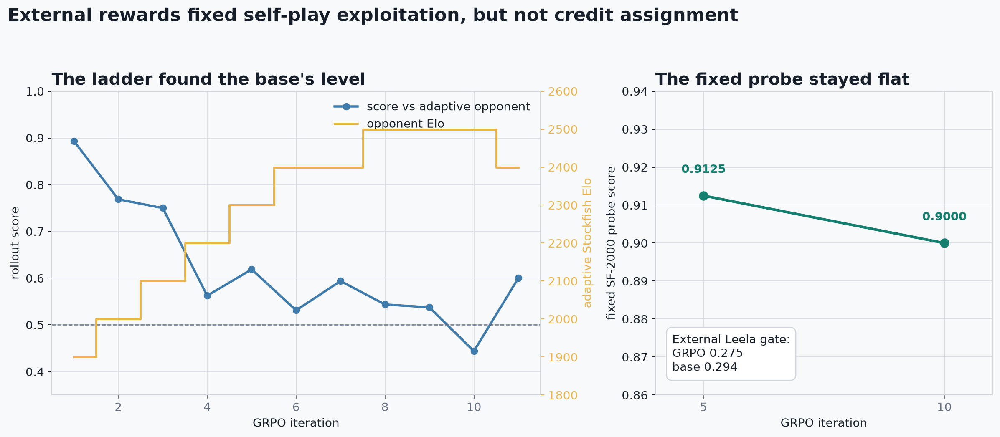
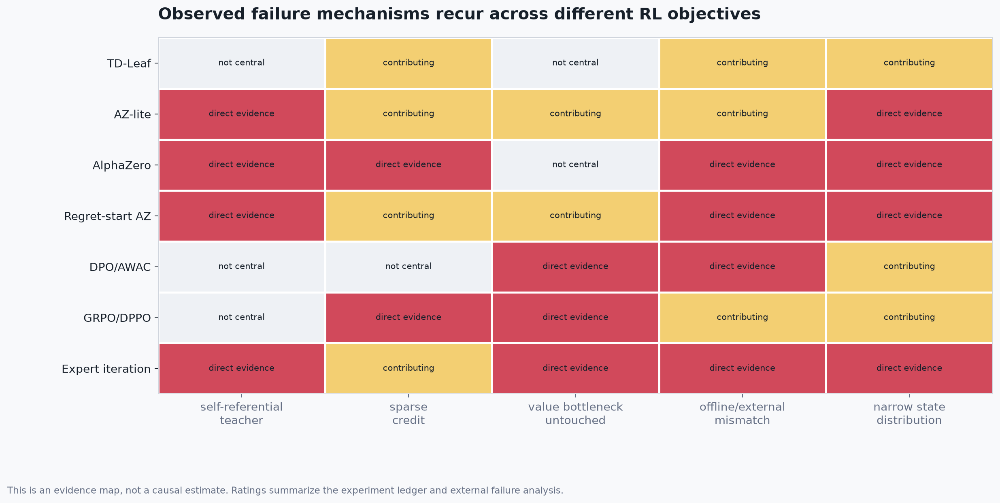

# Why the RL runs failed

## Result

The experiments do not show that reinforcement learning is ineffective for chess. They show a narrower result: every RL-style post-training method tested on this fixed Kibitzer representation was neutral or harmful when judged against an external opponent.

The strongest accepted checkpoint remains `runs/tactical/tactical_repair.pt`, which came from supervised mid-training. RL could optimize its local objective, beat a sibling, or preserve its starting strength. None of those signals produced a stronger external engine.


The lower panel is the important one. Each candidate is compared only with the baseline documented for that run. Protocols differ, so the bars are evidence about transfer, not a cross-method leaderboard.

## Experiment ledger

| method | optimized signal | decisive result | read |
|---|---|---|---|
| TD-Leaf value update | bootstrapped PUCT values plus terminal outcome | 0.762 vs 0.738 at SF-1900, delta +0.025 with large uncertainty | neutral |
| AZ-lite hard BC | search argmax plus game outcome | 0.388 against its parent | regressed |
| proper AlphaZero | visit distribution plus game outcome | 0.188 against its parent despite lower policy/value losses | regressed harder |
| monitored AZ iteration | self-play visits and actual outcomes | 0.625 against parent, then 0.100 vs Leela-2700 | sibling overfit |
| regret-start AZ | visits from 1,000 high-regret continuations | 0.075 vs parent checkpoint's 0.175 external score | regressed |
| DPO/AWAC preference repair | Stockfish good/bad move pairs plus KL anchor | 0.153 first run; 0.202 conservative retry vs 0.294 base | regressed |
| GRPO + exact-DPPO | external game outcome, searched rollouts, exact TV trust region | 0.275 vs 0.294 base | neutral |
| 512-sim expert iteration | hard argmax from the strongest known search teacher | 0.281 vs 0.287 at 128 sims; 0.763 vs 0.825 at 512 | neutral to negative |

Sources: [D15](../../DECISIONS.md#d15--reject-tdleaf-value-training), [D48](../../DECISIONS.md#d48--self-play-smoke-1-iteration-az-lite-regressed-the-model-negative), [D49](../../DECISIONS.md#d49--proper-alphazero-1-iteration-regressed-more-than-simple-bc-negative), [D56](../../DECISIONS.md#d56--stop-pure-az-and-try-regret-guided-teacher-repair), [D57](../../DECISIONS.md#d57--reject-regret-start-mini-self-play-without-external-teacher-labels), [D59](../../DECISIONS.md#d59--reject-teacher-preference-repair-despite-offline-pair-gains), [D60](../../DECISIONS.md#d60--grpo--exact-divergence-dppo-on-external-reward-plan--neutral-result), and [D65](../../DECISIONS.md#d65--512-sim-hard-target-self-play-expert-iteration--failed-the-gate-512-sim-strength-is-inference-only).

## Failure 1: self-play was not an independent teacher

The model generated trajectories using the same policy and value errors that training was supposed to fix. Search improved individual move choices, but it did not create a new source of strategic knowledge. The resulting targets were strongly correlated with the student's existing blind spots.

The cleanest evidence is the monitored AZ run. Its child checkpoint scored 0.625 against the parent, which looked like progress. Against Leela-2700 it scored 0.100, below the 0.225 base reference. The child learned to exploit its sibling's style rather than becoming broadly stronger.


The historical AZ experiments failed from both directions. Hard argmax targets preserved decisiveness but copied a teacher of roughly the same strength. Soft visit targets contained more search information, but at 128 simulations they were diffuse and softened a sharp supervised policy. Increasing the teacher to 512 simulations resolved that ambiguity: the stronger search still did not distill into better weights.

## Failure 2: game outcome was real but too coarse

The value head was trained with actual terminal outcomes in the AlphaZero runs. The issue was not an absence of outcome labels. One scalar result was broadcast across dozens of decisions, most of which had little causal responsibility for the result. That gives high-variance, long-horizon credit assignment.

GRPO removed the learned critic and used external Stockfish outcomes, group-relative advantages, searched rollouts, an exact legal-move TV trust region, and a base KL anchor. This closed the obvious self-play loopholes. It still did not create a gain.



The adaptive ladder climbed from 1900 to 2500 because the starting model was already around that level. The held-out SF-2000 probe moved from 0.9125 to 0.900, and the final Leela gate moved from 0.294 to 0.275. The optimizer preserved the policy; it did not discover a stronger one.

## Failure 3: the bottleneck and the update target did not match

The failure corpus contains 336 valid games. Opening ACPL was 8.4, middlegame ACPL 32.8, and endgame ACPL 44.2. Of 106 decisive losses, 81 were gradual and 25 were sudden. This is primarily positional drift, not isolated tactical blindness.

Separate interventions fence the value problem from both sides:

- enlarging or repairing the scalar value head improved offline value metrics but hurt play;
- reducing its weight in PUCT caused a monotonic external collapse;
- policy-only RL preserved the weak load-bearing value path but could not repair it;
- 512-sim search improved play by averaging many noisy evaluations, but expert iteration could not compress that inference-time averaging into the same representation.

The most conservative interpretation is a representation bottleneck. Small post-training updates were asked to fix strategic state evaluation without changing the features available to the value head.



The map is qualitative. `direct evidence` means that the corresponding experiment exposed the mechanism directly. It is not a causal effect size.

## Failure 4: offline success was not a promotion signal

Several runs looked healthy before play:

- proper AZ reduced policy loss from 1.83 to 1.72 and value loss from 0.29 to 0.14;
- preference repair reached pair accuracy 0.607 and pair margin 0.772 with anchor KL 0.0009;
- tactical and preference checkpoints passed or improved their local held-out objectives;
- GRPO generated informative groups and maintained a stable trust region.

These metrics only verify that optimization worked. They do not verify that the target distribution contains strength-improving information. External fixed-opponent play was therefore the only valid promotion gate.


## What this establishes

1. The current fixed representation is at a post-training ceiling under the tested budgets and objectives.
2. Sibling head-to-head results are unsafe promotion evidence.
3. Outcome-trained value learning was attempted; its labels were too sparse and its representation remained the limiting factor.
4. Policy-only RL cannot recover strength that exists only through deeper value averaging at inference.
5. More RL coefficient tuning has a weak prior after GRPO/DPPO and 512-sim expert iteration both failed clean external gates.

This does not establish an architecture-independent ceiling. A larger or different representation, history-aware input, better value pooling, distributional value prediction, or a much larger population-based self-play system could change the result. Those are new model programs, not another repair pass on the current checkpoint.

## Evidence limits

- Early experiments used 20 to 40 games and have wide uncertainty.
- Baselines, seeds, simulation counts, and opponents changed across the research sequence.
- The summary graph uses each run's own documented baseline and does not compare absolute strength across protocols.
- Stockfish `UCI_Elo`, one-node Leela, and sibling matches are different rating surfaces.
- The external failure pattern is repeated, but exact Elo differences should not be inferred from this report.

## Rebuild

The plotted values are frozen in `evidence.json` from the checked experiment ledger and raw report artifacts.

```bash
uv run python reports/rl_failures/make_figures.py
```
