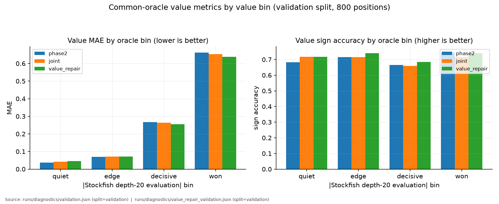
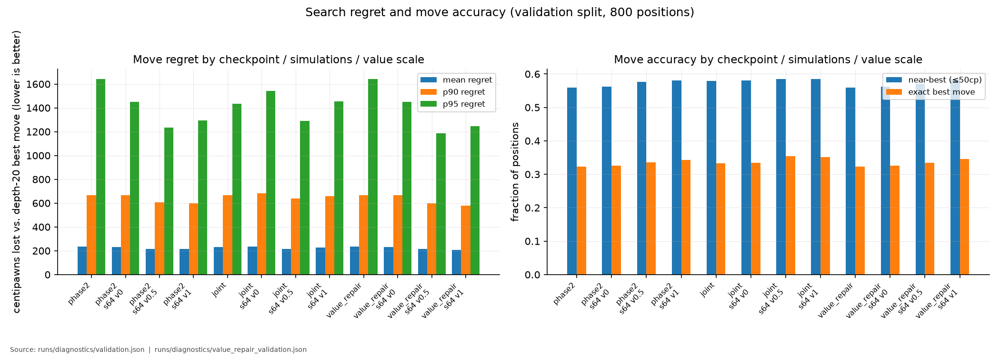
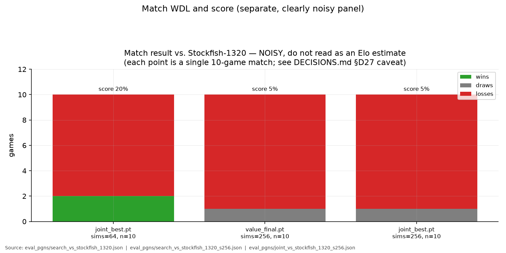

# Run analysis report

Regenerated deterministically from repo-local training/evaluation evidence by
`scripts/plot_run_analysis.py`. Every figure lists its exact source file(s) in a
footnote; metrics with no local evidence are drawn as an explicit orange
"not recorded" panel rather than omitted or invented.

Regenerate with:

```bash
uv run python scripts/plot_run_analysis.py
```

## Figures

### Value-head training loss and value metrics by epoch


Value stage (5 epochs, Stockfish depth-14 regression) and value-repair Stage A (3 epochs, balanced bin sampling) MSE/MAE, Pearson r/sign accuracy, and R² across training epochs. Two independent training runs, plotted on shared per-metric axes so scales are never mixed.

### Policy metrics by epoch


Joint distillation stage (5 epochs) policy cross-entropy and teacher agreement/coverage. The Phase-1 policy-only stage is drawn as an explicit unavailable panel: `scripts/train_bc.py` never computes held-out metrics or persists a per-epoch log, so no epoch curve exists locally for it.

### Common-oracle value metrics by value bin



Value MAE and sign accuracy for phase2, joint, and value-repair checkpoints against the locked common-oracle **validation** split (800 real-game positions, depth-20 Stockfish, game-disjoint from training), broken out by the quiet/edge/decisive/won magnitude bins.

### Search regret, near-best, and best-move accuracy by checkpoint/sims/value-scale



Mean/p90/p95 move regret (centipawns lost vs. the depth-20 best move) and near-best/exact-best-move accuracy, for each checkpoint at raw policy play and at 64 PUCT simulations across value_scale in {0, 0.5, 1}. Regret (cp) and accuracy (fraction) are kept on separate axes.

### Match WDL and score (noisy, separate panel)



Full-game win/draw/loss results vs. Stockfish-1320 from the small local cutechess-style matches. Each bar is a single 10-game match , explicitly labeled as noisy and kept out of the metric-based figures above so it cannot be mistaken for a precise Elo comparison.

## Evidence inventory

| evidence | available | source |
|---|---|---|
| value stage epoch curve | yes | LOGBOOK.md D25 (value stage table) |
| value-repair stage epoch curve | yes | runs/value_repair/value_repair_best_epoch_{1,2,3}.pt (eval_metrics) |
| joint stage policy epoch curve | yes | LOGBOOK.md D27 (joint stage table) |
| policy-only Phase-1 stage epoch curve | **no** | scripts/train_bc.py (train_bc.py does not compute held-out metrics or persist a per-epoch loss log locally) |
| common-oracle value metrics by bin | yes | runs/diagnostics/validation.json, runs/diagnostics/value_repair_validation.json |
| search regret / near-best / best-move by checkpoint, sims, value scale | yes | runs/diagnostics/validation.json, runs/diagnostics/value_repair_validation.json |
| match WDL / score vs Stockfish | yes | eval_pgns/search_vs_stockfish_1320.json, eval_pgns/search_vs_stockfish_1320_s256.json, eval_pgns/joint_vs_stockfish_1320_s256.json (small-sample (10 games/config); noisy by construction) |

## Inspected but not charted

- `runs/diagnostics/value_label_audit.json`: a one-shot depth-14-vs-depth-20 label-ceiling audit (overall MAE 0.0217, sign disagreement 2.90%, decision `cached_labels_have_headroom`). It is a single scalar verdict, not a metric series across epochs/checkpoints/bins, so it is reported here as text rather than forced into a chart.
- `runs/diagnostics/value_repair_head_to_head.json`: a narrower phase2-vs-value_repair comparison (only the `s64:v1` configuration) that is a strict subset of `value_repair_validation.json`, which is used for the figures above instead.
- `runs/policy/policy_final.yaml`, `runs/joint_distill/joint_best.yaml`, `runs/value/value_final.yaml`: final-checkpoint config/metric snapshots, used to cross-check the epoch curves above but not separately plotted.

## Locked test split

Every `runs/diagnostics/*.json` report consumed by this script asserts `"split": "validation"` before use (see `assert_validation_split` in `kibitzer/run_analysis.py`); the script raises rather than plotting if a report is not the validation split. No locked test-split evaluation exists locally as of this run, so none is presented as evaluated here.
