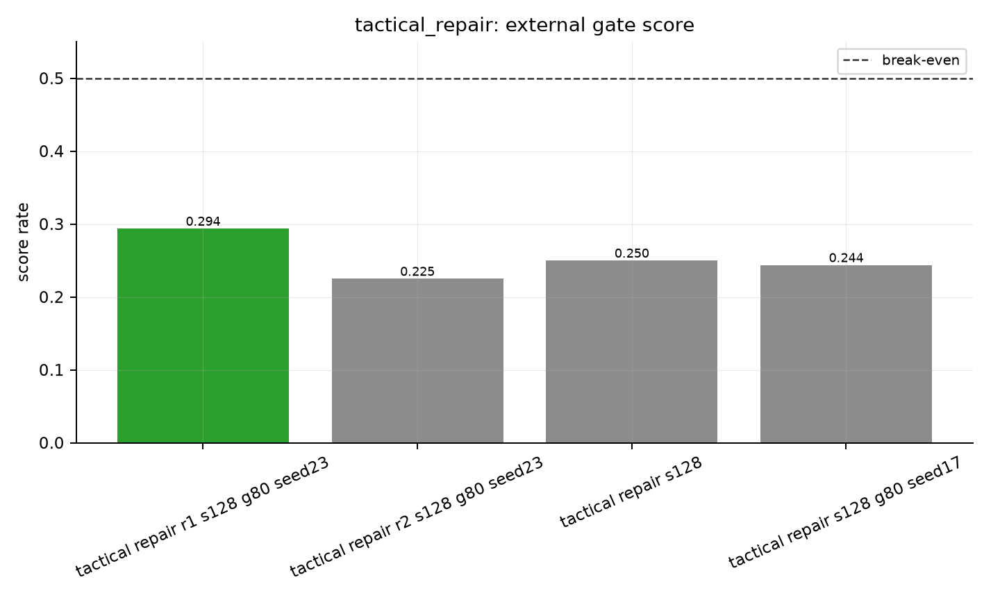
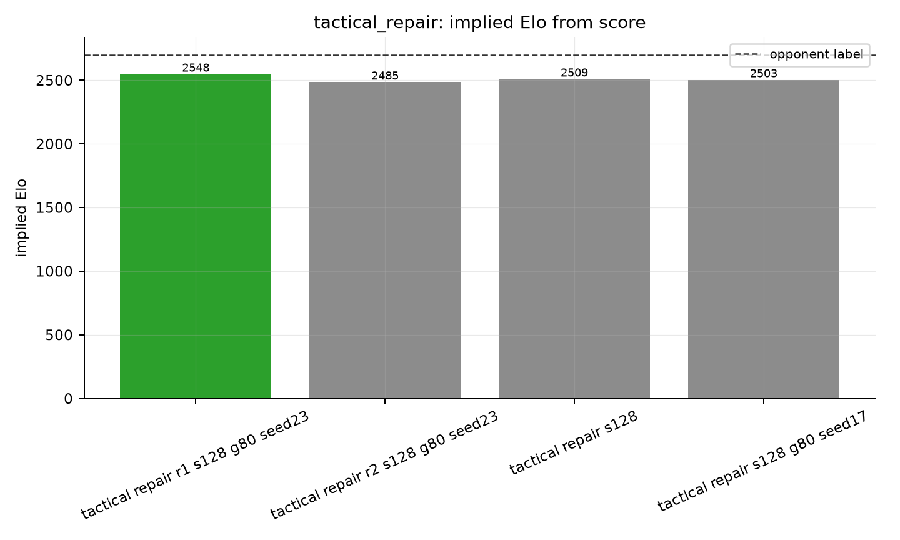

# tactical_repair eval report

Best score here: `tactical repair r1 s128 g80 seed23` at `0.294` (12W/23D/45L), implied Elo `2548`.

## Figures

- 
- 
- 

## Matches

| run | games | W/D/L | score rate | Elo delta | implied Elo | source |
|---|---:|---:|---:|---:|---:|---|
| tactical repair r1 s128 g80 seed23 | 80 | 12/23/45 | 0.294 | -152 | 2548 | `tactical_repair_r1_vs2700_s128_g80_seed23.jsonl` |
| tactical repair r2 s128 g80 seed23 | 80 | 9/18/53 | 0.225 | -215 | 2485 | `tactical_repair_r2_vs2700_s128_g80_seed23.jsonl` |
| tactical repair s128 | 20 | 2/6/12 | 0.250 | -191 | 2509 | `tactical_repair_vs2700_s128.jsonl` |
| tactical repair s128 g80 seed17 | 80 | 7/25/48 | 0.244 | -197 | 2503 | `tactical_repair_vs2700_s128_g80_seed17.jsonl` |
