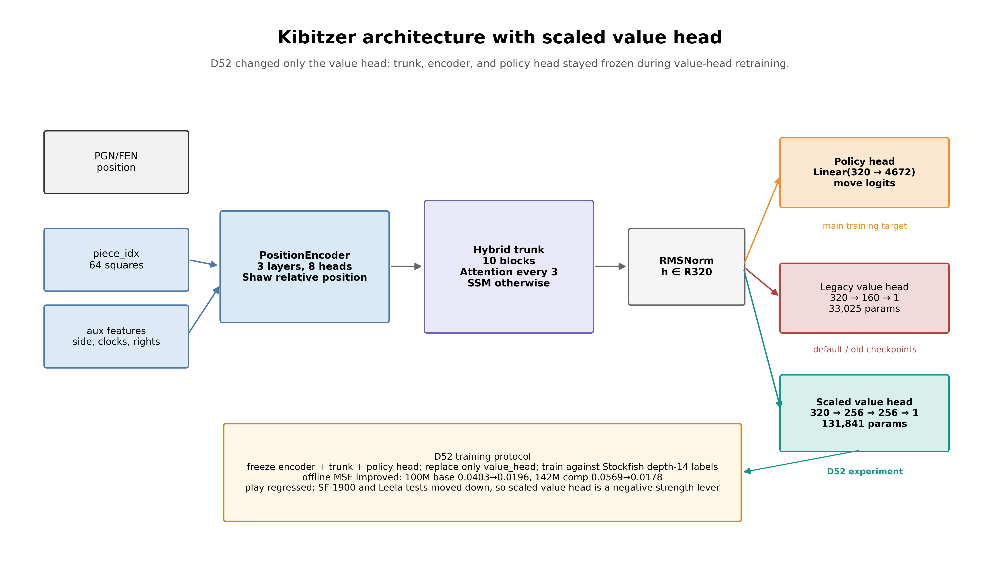
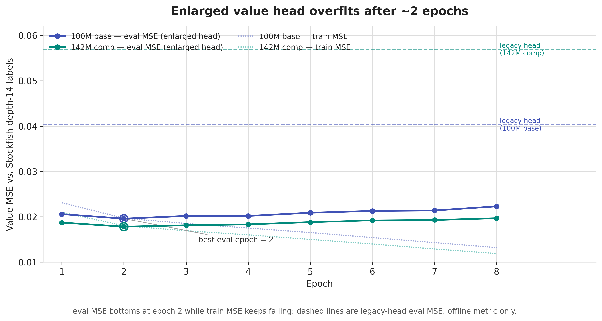

# Value-Head Capacity Experiment (D52)

## Motivation

The value head has been a suspiciously thin component throughout this project: a 33,025-parameter
MLP bolted onto trunks of 100M (base) and 142M (comp) parameters. D50's alpha-beta diagnostic ,
using the value head directly as a minimax leaf evaluator at 128 net-evals , collapsed to a ~0.075
win-rate, far below what a usable leaf value should produce. That result flagged the value head as
a plausible bottleneck: maybe it's simply too small to represent position value accurately, and a
larger head would fix both the offline fit and the downstream search/play behavior.

This experiment tests that hypothesis directly: enlarge the value head, retrain it against a better
target (Stockfish depth-14 evaluations), and measure whether offline accuracy gains translate into
either stronger play or a usable alpha-beta leaf.

## Method

- Value head enlarged from 33,025 -> 131,841 parameters (4x). Trunk and policy head frozen; only
  the value head is retrained, in isolation, against a 250k-position Stockfish depth-14 label
  cache.
- Applied to both available trunks independently: the 100M base model and the 142M comp model,
  to check whether any effect generalizes across model scale.
- Evaluated offline on a 25,010-position game-disjoint held-out set (MSE and Pearson correlation
  against Stockfish depth-14 labels), tracking the best epoch by eval MSE (both models bottom out
  at epoch 2 before overfitting -- see `fig_valuehead_epochs.png`).
- Evaluated in play three ways:
  - PUCT search vs Stockfish-1900, 64 sims/move, 20 games, both models, legacy vs enlarged head.
  - PUCT search vs a Leela net (t1-256x10-distilled, nodes=1, a ~2700-rated tactical yardstick),
    20 games, comp model only.
  - Alpha-beta minimax at 128 net-evals using the value head as the leaf evaluator directly (no
    PUCT), comp model only, enlarged head vs the D50 legacy-head reference.

## Results

| Metric | Legacy head (33k) | Enlarged head (132k) | Direction |
|---|---|---|---|
| Offline value MSE -- 100M base (lower better) | 0.0403 | 0.0196 | **-51%**, improved |
| Offline value MSE -- 142M comp (lower better) | 0.0569 | 0.0178 | **-69%**, improved |
| Pearson r -- 100M base | 0.840 | 0.898 | improved |
| Pearson r -- 142M comp | 0.852 | 0.908 | improved |
| PUCT win-rate vs SF-1900 -- 100M base (n=20, higher better) | 0.775 | 0.625 (11W/3D/6L) | **-15pp, regressed** |
| PUCT win-rate vs SF-1900 -- 142M comp (n=20, higher better) | 0.783 | 0.650 (11W/4D/5L) | **-13pp, regressed** |
| PUCT win-rate vs Leela ~2700 -- 142M comp (n=20, higher better) | 0.225 (3W/3D/14L) | 0.150 (1W/4D/15L) | **-7.5pp, regressed** |
| Alpha-beta leaf win-rate @128 evals -- 142M comp | ~0.075 (D50 ref) | ~0.19 | improved but still collapsed |

Win-rates use Wilson 95% confidence intervals (n=20 per bar); see `fig_valuehead_offline_vs_play.png`
and `fig_valuehead_play_summary.png` for the intervals plotted against each bar.

Every play comparison moved in the same direction -- worse -- on two independent trunks and two
different opponents. The alpha-beta diagnostic improved in absolute terms (0.075 -> 0.19) but
remains far below a usable search leaf; more offline accuracy narrowed the gap without closing it.

## Verdict

**Negative result.** Enlarging the value head 4x and retraining it against stronger labels
substantially improves offline value accuracy (MSE roughly halved to two-thirds reduced, Pearson
correlation up on both models) but *consistently degrades real play* -- on both trunks, against both
opponents tested, and without fixing the alpha-beta collapse. Offline value accuracy is not the
strength bottleneck, and current evidence suggests a better-fitting value function on Stockfish
labels can actively hurt PUCT play, likely by producing sharper but less well-calibrated
evaluations under search, or by no longer matching whatever implicit value scale the policy head
and search routine were tuned against.

The value head is now a **closed lever**: this is the second and more decisive test after D50
(which only diagnosed the alpha-beta collapse) showing that manipulating value-head capacity or
fit quality does not move play strength in the intended direction. Consistent with the broader
pattern in this project's decision log -- fine-tuning/architecture tweaks around value learning
keep failing to convert into play gains -- the remaining lever is scale (params/data), not further
value-head engineering.

## Figures

**Figure 0 -- architecture with scaled value head**

Shows the shared encoder/trunk/policy path and the D52-only value-head change: legacy `320 -> 160 -> 1`
(33k params) versus scaled `320 -> 256 -> 256 -> 1` (132k params). The training protocol froze the encoder,
trunk, and policy head, then retrained only the scaled value head.

**Figure 1 -- offline MSE before/after, both models**

Held-out value MSE for the legacy vs. enlarged head on both trunks, at the best enlarged-head
epoch. Confirms the offline half of the story: -51% (base) and -69% (comp) MSE reduction.

**Figure 2 -- training/eval MSE vs. epoch**

Enlarged-head eval MSE bottoms out at epoch 2 on both models while train MSE keeps falling --
classic overfitting on a small task-specific head. Best-epoch checkpoints are what feed the
comparisons in Figures 1, 3, and 4.

**Figure 3 -- offline vs. play, the central dissonance**

Side-by-side panels sharing the same model grouping: offline MSE improves (green, left) while
play win-rate vs. Stockfish-1900 regresses (red, right) on both the 100M base and 142M comp
models. This is the headline result of the experiment -- better offline fit does not mean better
play, and here it means worse play.

**Figure 4 -- full play summary across opponents**

All measured play win-rates together: SF-1900 (both models) and Leela ~2700 (comp model), legacy
vs. enlarged head, all with Wilson 95% CIs. Every bar moves down under the enlarged head. The
alpha-beta diagnostic (win-rate ~0.19 vs. the D50 legacy-head reference of ~0.075) is annotated --
improved but still far from a usable search leaf.
