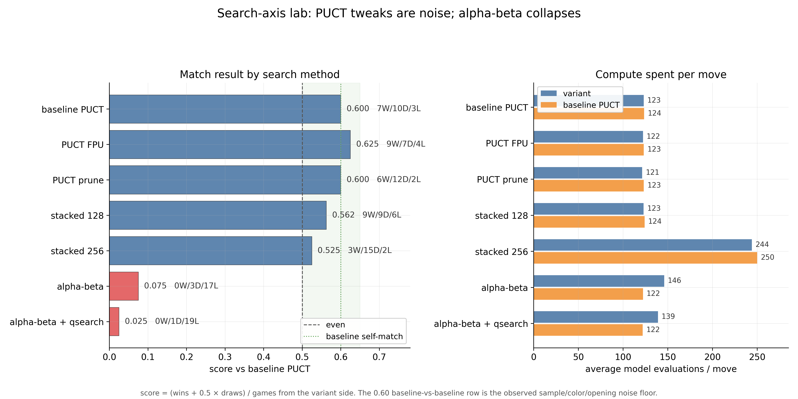

# Search Lab



This lab compares search methods over the same trained Kibitzer policy/value network. The control is
`baseline_puct`; every variant is matched against it from the same opening book, alternating colors, with a fixed
net-evaluation budget per move.

## Metrics

Score from the variant side:

```text
score = (wins + 0.5 * draws) / games
```

Average net evaluations per move:

```text
avg_evals = total_model_evaluate_calls / played_moves
```

PUCT child score:

```text
score(s, a) = -Q(s, a) + c_puct * P(s, a) * sqrt(N(s)) / (1 + N(s, a))
```

The local PUCT variants use the same backup convention as the main search: child `Q` is stored from the child
side, so parent selection negates it.

Alpha-beta negamax recurrence:

```text
V(s, d) = max_a -V(next(s, a), d - 1)
```

Leaf evaluation:

```text
V(s, 0) = value_net(s)
```

Quiescence extension:

```text
Q(s) = value_net(s), then recursively extend only capture moves while budget remains
```

## Methods

- `baseline_puct`: vanilla repo PUCT, used as the control.
- `puct_fpu`: PUCT with first-play urgency `FPU = -0.2` for unvisited children.
- `puct_prune`: PUCT after dropping children with prior `< 0.15 * max_prior`.
- `puct_stacked`: combines FPU and prior pruning.
- `alphabeta`: iterative deepening negamax alpha-beta using policy priors only for move ordering.
- `alphabeta_quiescence`: alpha-beta plus capture-only quiescence at leaves.

## Read

PUCT variants land inside the baseline self-match noise band. Alpha-beta collapses despite similar or higher
evaluation spend, which points at the value head being too weak/miscalibrated for minimax leaf evaluation. The
policy-guided averaging in PUCT is still the safer search mode for this model.
